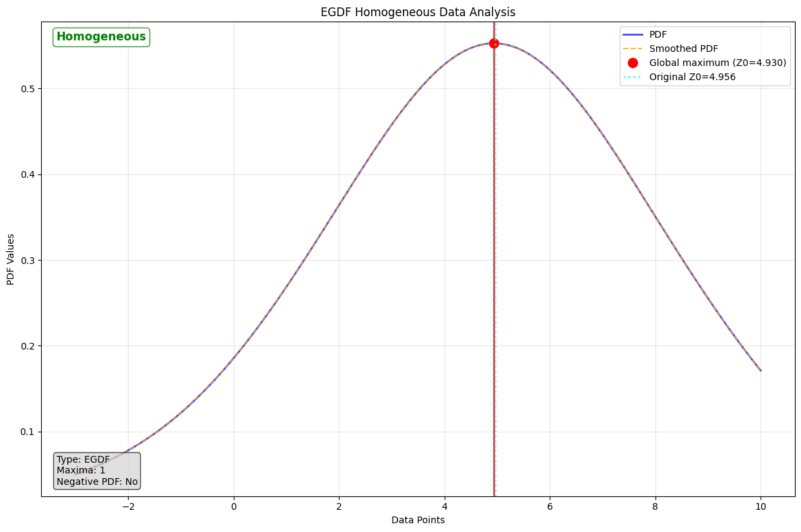

# DataHomogeneity: Homogeneity Analysis for EGDF (Machine Gnostics)

Analyze data homogeneity for EGDF objects using probability density function analysis. This class provides comprehensive homogeneity analysis for Estimating Global Distribution Functions (EGDF) by examining the shape and characteristics of their probability density functions (PDF).

---

## Overview

The homogeneity criterion is based on the mathematical properties and expected PDF behavior of EGDF according to Mathematical Gnostic theory principles.

**Gnostic Theory Foundation:**  
The EGDF is uniquely determined by the data sample and finds the optimal scale parameter automatically. Unlike local distribution functions, EGDF has limited flexibility and provides a unique representation for each homogeneous data sample. The key principle is that homogeneous data should produce a distribution with a single density maximum, while non-homogeneous data will exhibit multiple maxima or negative density values.

**Homogeneity Criteria:**

- **EGDF (Estimating Global Distribution Function)**: Data is considered homogeneous if:
    1. PDF has exactly one global maximum (single peak)
    2. PDF contains no negative values

**EGDF Characteristics:**

- **Uniqueness**: EGDF finds the best scale parameter automatically, providing a unique model
- **Robustness**: EGDF is robust with respect to outliers
- **Homogeneity Testing**: Particularly suitable for reliable data homogeneity testing
- **Global Nature**: Uses normalized weights resulting in limited flexibility controlled by optimal scale
- **Data-Driven**: Primary parameters are the data themselves, following gnostic "let data speak" principle

**Non-Homogeneity Detection:**

EGDF can sensitively detect two main causes of non-homogeneity:
1. **Outliers**: Individual data points significantly different from others, creating local maxima
2. **Clusters**: Separate groups in the data, resulting in multiple density peaks

**Analysis Pipeline:**

1. **Validation**: Ensures input is EGDF only (rejects QGDF/ELDF/QLDF)
2. **PDF Extraction**: Retrieves PDF points from fitted EGDF object
3. **Smoothing**: Applies Gaussian filtering for noise reduction
4. **Maxima Detection**: Identifies peaks in the smoothed PDF
5. **Homogeneity Assessment**: Evaluates based on peak count and PDF negativity
6. **Result Storage**: Comprehensive parameter collection and storage

---

## Key Features

- Automatic EGDF validation
- Robust peak detection with configurable smoothing
- Comprehensive error and warning tracking
- Memory management with optional data flushing
- Detailed visualization of analysis results
- Integration with existing GDF parameter systems

---

## Parameters

| Parameter          | Type             | Default | Description                                                        |
| ------------------ | ---------------- | ------- | ------------------------------------------------------------------ |
| `gdf`              | EGDF             | -       | Fitted Estimating Global Distribution Function object.             |
| `verbose`          | bool             | False   | Controls output verbosity during analysis.                         |
| `catch`            | bool             | True    | Enables comprehensive result storage in params dictionary.         |
| `flush`            | bool             | False   | Controls memory management of large arrays after analysis.         |
| `smoothing_sigma`  | float            | 1.0     | Gaussian smoothing parameter for PDF preprocessing.                |
| `min_height_ratio` | float            | 0.01    | Minimum relative height threshold for peak detection.              |
| `min_distance`     | int (Optional)   | None    | Minimum separation between detected peaks in array indices.        |

---

## Attributes

- **is_homogeneous**: `bool` or `None`
  Primary analysis result. None before fit(), True/False after analysis.
- **picks**: `List[Dict]`
  Detected maxima with detailed information.
- **z0**: `float` or `None`
  Global optimum value from EGDF object or detected from PDF.
- **global_extremum_idx**: `int` or `None`
  Array index of the global maximum.
- **fitted**: `bool`
  Read-only property indicating if analysis has been completed.

---

## Methods

### `fit(plot=False)`

Perform comprehensive homogeneity analysis on the EGDF object. It analyzes the probability density function (PDF) of the fitted EGDF object to determine if the underlying data exhibits homogeneous characteristics.

- **plot**: `bool` (optional, default=False)
  If True, generates plots for visual inspection of the analysis results.

**Returns:**
`bool` — True if data is homogeneous, False otherwise.

---

### `results()`

Retrieve comprehensive homogeneity analysis results and metadata.

**Returns:**
`Dict[str, Any]` — Comprehensive results dictionary including core findings, maxima information, PDF characteristics, analysis configuration, and diagnostics.

---

### `plot(figsize=(12, 8), title=None)`

Create a comprehensive visualization of the homogeneity analysis results, displaying the PDF, detected maxima, and status.

- **figsize**: `tuple` (default=(12, 8))
  Figure dimensions in inches as (width, height).
- **title**: `str` (optional)
  Custom plot title.

**Returns:**
None

---

## Example Usage

=== "Python"

    ```python
    import numpy as np
    from machinegnostics.magcal import EGDF, DataHomogeneity
    
    # Homogeneous data
    data = np.array([ -3, 0, 1., 2., 3., 4., 5., 6., 7., 8., 9., 10.])
    egdf = EGDF(data=data, catch=True)
    egdf.fit()
    
    # Homogeneity analysis
    homogeneity = DataHomogeneity(egdf, verbose=True)
    is_homogeneous = homogeneity.fit(plot=True)
    print(f"Data is homogeneous: {is_homogeneous}")
    
    # Access results
    results = homogeneity.results()
    print(f"Number of maxima detected: {len(results['picks'])}")
    ```

=== "Output"

    

---

## Notes

**Mathematical Background:**

The gnostic homogeneity analysis is based on the principle that homogeneous data should produce a unimodal PDF with specific characteristics for EGDF:

- **EGDF Uniqueness**: Each data sample has exactly one optimal EGDF representation
- **Scale Optimization**: EGDF automatically finds the best scale parameter S_opt
- **Density Properties**: Homogeneous data produces single maximum, non-negative density
- **Numerical Sensitivity**: Analysis must be numerical, not based on visual inspection

**Why Only EGDF:**

Homogeneity testing is only applicable to EGDF because:

- EGDF provides unique representation for each data sample
- Automatic scale parameter optimization enables reliable homogeneity testing
- Global nature with normalized weights makes it suitable for detecting data structure
- Robustness against outliers while maintaining sensitivity to detect them

**Parameter Tuning Guidelines:**

- **smoothing_sigma**: Start with 1.0, increase for noisy data to improve numerical stability
- **min_height_ratio**: Start with 0.01, increase to reduce false positives from noise
- **min_distance**: Usually auto-calculated, manually set for specific data characteristics

---

**Author:** Nirmal Parmar   
**Date:** 2025-10-10
