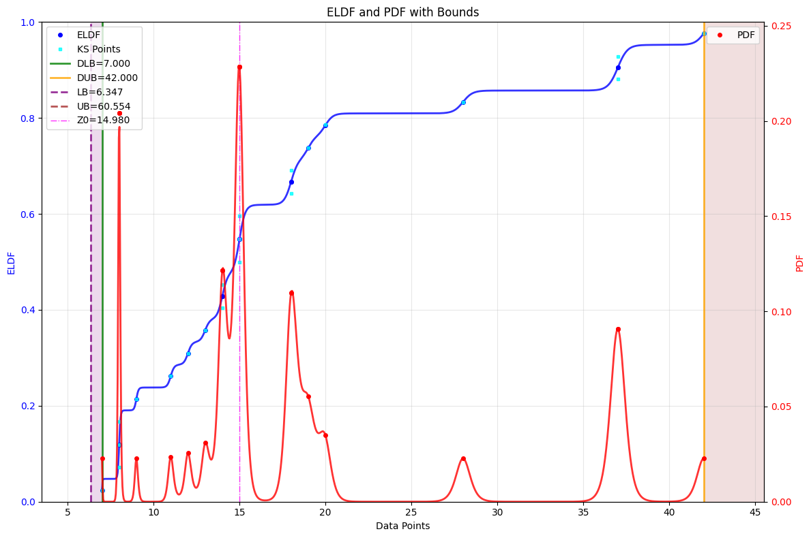

# DataScedasticity: Gnostic Homoscedasticity and Heteroscedasticity Test (Machine Gnostics)

The `DataScedasticity` class provides a gnostic approach to testing for homoscedasticity and heteroscedasticity in data using local gnostic distribution functions (ELDF, QLDF). Unlike classical statistical tests that check residuals, this method analyzes the variability of the gnostic scale parameter.

---

## Overview

This class determines whether a dataset is homoscedastic (constant scale) or heteroscedastic (varying scale) using a fitted Gnostic (Local) Distribution Function (GDF).

**The Gnostic Approach:**
If the estimated Scale parameter (`S`) is variable across the domain (`varS=True`), the data is considered heteroscedastic. If the Scale parameter is constant, the data is homoscedastic.

**Key differences vs. standard tests:**
- Uses GDF's scale parameter (`S_var`) instead of residual-based heuristics.
- Works with local/global gnostic scale (`S_local`, `S_opt`) for inference.
- Integrates directly with Machine Gnostics models (`ELDF`, `QLDF`).

---

## Key Features

- **Direct GDF Integration**: Works seamlessly with `ELDF` and `QLDF`.
- **Scale-Based Inference**: Uses the fundamental gnostic scale parameter.
- **Robust Classification**: Simple decision boundary based on scale variability.
- **Detailed Diagnostics**: Provides access to local and global scale parameters.

---

## Parameters

| Parameter | Type                  | Default | Description                                                               |
| --------- | --------------------- | ------- | ------------------------------------------------------------------------- |
| `gdf`     | `Union[ELDF, QLDF]`   | `ELDF`  | Fitted GDF instance (must be `ELDF` or `QLDF`) configured with `varS=True`. |
| `catch`   | `bool`                | `True`  | Whether to store analysis results in `params`.                            |
| `verbose` | `bool`                | `False` | Enables debug-level logging when `True`.                                  |

---

## Attributes

- **gdf**: `Union[ELDF, QLDF]`
  The underlying GDF instance.
- **params**: `dict`
  Results container populated after `fit()`.
- **fitted**: `bool`
  Boolean indicating whether scedasticity classification has been run.

---

## Methods

### `fit()`

Classify scedasticity based on the variability of the GDF's scale parameter.

**Returns:**
`bool` — `True` if data is homoscedastic (constant scale), `False` if heteroscedastic.

---

### `results()`

Return a dictionary summarizing the scedasticity analysis.

**Returns:**
`dict` — Contains keys:

- `'scedasticity'`: `'homoscedastic'` or `'heteroscedastic'`
- `'scale_parameter'`: The `S_var` array from the GDF
- `'S_local'`: Local gnostic scale values
- `'S_global'`: Global/optimal gnostic scale (`S_opt`)

---

## Example Usage

=== "Python"

    ```python
    import numpy as np
    from machinegnostics.magcal import ELDF, DataScedasticity
    
    # Example data (stack-loss data)
    y = np.array([ 7,  8,  8,  8,  9, 11, 12, 13, 14, 14, 15, 15, 15, 18, 18, 19, 20, 28, 37, 37, 42])
    
    # Step 1: Fit ELDF with variable scale (essential for scedasticity check)
    eldf = ELDF(varS=True, verbose=False)
    eldf.fit(data=y, plot=True)
    
    # Step 2: Run scedasticity test
    sc = DataScedasticity(gdf=eldf, verbose=True)
    is_homo = sc.fit()
    
    # Step 3: Check results
    print(f"Is data homoscedastic? {is_homo}")
    info = sc.results()
    ```

=== "Output"

    

---

## Notes

- The supplied `gdf` must be an instance of `ELDF` or `QLDF`, fitted with `varS=True`.
- Validation is performed during initialization to ensure the GDF is compatible.
- `fit()` sets the internal state; call `results()` afterwards to obtain a structured dictionary of outputs.

---

**Author:** Nirmal Parmar   
**Date:** 2025-10-10
