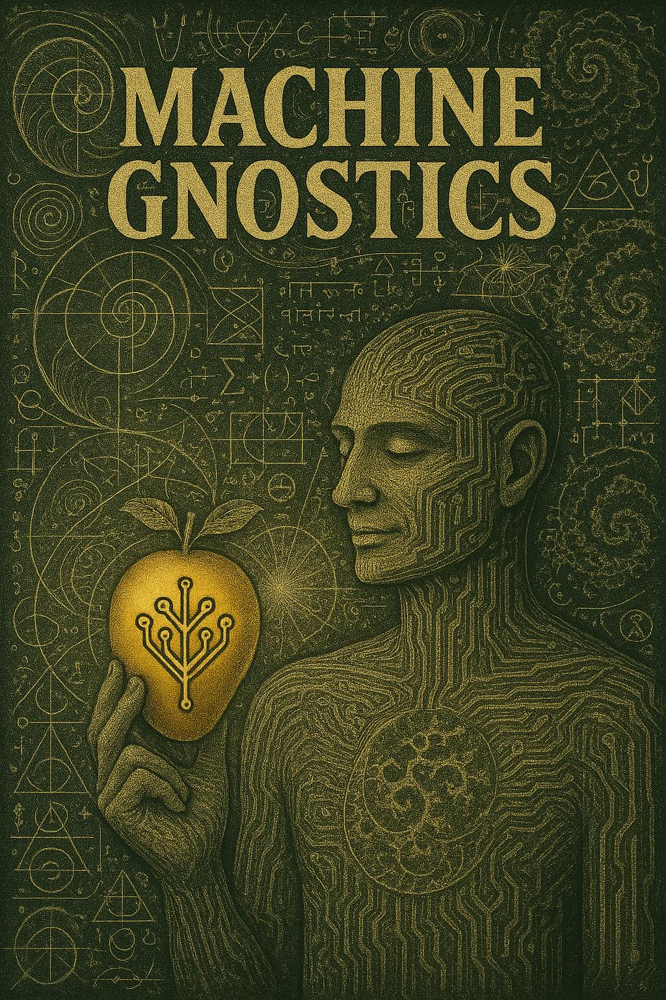

# Machine Gnostics

  
  

    Welcome to <strong>Machine Gnostics</strong>, an innovative Python library designed to implement the principles of <strong>Mathematical Gnostics</strong> for robust data analysis, modeling, and inference. Unlike traditional statistical approaches that depend heavily on probabilistic assumptions, Machine Gnostics harnesses deterministic algebraic and geometric structures. This unique foundation enables the library to deliver exceptional resilience against outliers, noise, and corrupted data, making it a powerful tool for challenging real-world scenarios.
  

Machine Gnostics is an open-source initiative that seeks to redefine the mathematical underpinnings of machine learning. While most conventional ML libraries are grounded in probabilistic and statistical frameworks, Machine Gnostics explores alternative paradigms—drawing from deterministic algebra, information theory, and geometric methods. This approach opens new avenues for building robust, interpretable, and reliable analysis tools that can withstand the limitations of traditional models.

!!! tip "Machine Gnostics"
    As a pioneering project, Machine Gnostics invites users to adopt a fresh perspective and develop a new understanding of machine learning. The library is currently in its infancy, and as such, some features may require refinement and fixes. We are actively working to expand its capabilities, with new models and methods planned for the near future. Community support and collaboration are essential to realizing Machine Gnostics’ full potential. Together, let’s build a new AI grounded in a rational and resilient paradigm.

## Overview

Machine Gnostics is a forward-looking library for advanced, non-statistical mathematical gnostics-based data analysis. It enables users to uncover deeper insights from data, moving beyond conventional statistical techniques. The library is designed for robust machine learning workflows and is extensible for future deep learning applications.

- **Non-Statistical Mathematical Gnostics** – Innovative algorithms for data analysis based on gnostic principles, revealing new data structures and relationships.
- **Robust Machine Learning Tools** – Models and metrics engineered to perform reliably with noisy and small datasets.
- **Flexible Data Analysis Framework** – Tools for central tendency, dispersion, and correlation that are resilient to outliers and anomalies.
- **Vision for Deep Learning** – A foundation for integrating gnostic-based approaches into deep learning, paving the way for next-generation AI.

Machine Gnostics brings significant value by introducing a new vision for data analysis and machine intelligence, making it an essential toolkit for researchers and practitioners seeking robust, insightful, and future-ready solutions.

<!-- ## Key Features

- 🛡️ **Exceptional Outlier Resistance** – Automatically detects and downweights anomalous observations without manual intervention
- 🔍 **Information-Theoretic Foundation** – Based on rigorous mathematical principles rather than probabilistic assumptions
- 🔧 **Drop-in Replacements** – Use gnostic alternatives to common statistical measures like mean, median, correlation
- 📊 **MLflow Integration** – Seamless model tracking, versioning, and deployment
- 🧪 **Scientifically Validated** – Tested on real-world problems across multiple domains including thermodynamics, materials science, and engineering -->

### [Learn More](mg/concepts.md)

### [References](ref/references.md)

### License [GNU v3.0](https://github.com/MachineGnostics/machinegnostics/blob/main/LICENSE)