# Machine Gnostics 
  

  Welcome to `Machine Gnostics`, an innovative Python library designed to implement the principles of Mathematical Gnostics for robust data analysis, modeling, and inference. Unlike traditional statistical approaches that depend heavily on probabilistic assumptions, Machine Gnostics harnesses deterministic algebraic and geometric structures. This unique foundation enables the library to deliver exceptional resilience against outliers, noise, and corrupted data, making it a powerful tool for challenging real-world scenarios.

  

!!! success "Machine Gnostics"
    Laws of Nature, Encoded—For Everyone!

```mermaid
graph LR
    Entropy["Entropy"]
    Curvature["Space Curvature"]
    Bounds["[0, ∞] Bounds"]
    Laws["Laws of Nature"]
    MG["Machine Gnostics"]
    AI["**AI** built with 'Laws of Nature'"]
    Universe["Universe"]

    Universe --> Entropy
    Universe --> Curvature
    Universe --> Bounds

    Entropy --> Laws
    Curvature --> Laws
    Bounds --> Laws

    Laws --> MG
    Laws -.-> AI
    MG --> AI

    %% Help center Laws visually
    Entropy -.-> MG
    Curvature -.-> MG
    Bounds -.-> MG

    style Universe stroke-width:2px
    style Laws stroke-width:3px
    style MG stroke-width:2px
    style AI stroke-width:2px
```

Machine Gnostics is an open-source initiative that seeks to redefine the mathematical underpinnings of machine learning. While most conventional ML libraries are grounded in probabilistic and statistical frameworks, Machine Gnostics explores alternative paradigms—drawing from deterministic algebra, information theory, and geometric methods. This approach opens new avenues for building robust, interpretable, and reliable analysis tools that can withstand the limitations of traditional models.

!!! tip "Machine Gnostics"
    As a pioneering project, Machine Gnostics invites users to adopt a fresh perspective and develop a new understanding of machine learning. The library is currently in its infancy, and as such, some features may require refinement and fixes. We are actively working to expand its capabilities, with new models and methods planned for the near future. Community support and collaboration are essential to realizing Machine Gnostics’ full potential. Together, let’s build a new AI grounded in a rational and resilient paradigm.

    Machine Gnostics challenges the limitations of traditional, probabilistic models. Instead of relying on assumptions and large data samples, it encodes the very laws of nature—geometry, physics, entropy—into algorithms that extract truth from data, even when samples are small, noisy, or corrupted.

---

## Data Science Rooted in Nature

Machine Gnostics challenges the limitations of traditional, probabilistic models. Instead of relying on assumptions and large data samples, it encodes the very laws of nature—geometry, physics, entropy—into algorithms that extract truth from data, even when samples are small, noisy, or corrupted.

> **“Let data speak for themselves.”**
> Machine Gnostics empowers you to uncover the real structure of your data, free from statistical dogma.

---

## Why Machine Gnostics?

- **Beyond Statistics:** Move past fragile, assumption-heavy models. MG is built for the real world—messy, complex, and unpredictable.
- **Nature-Inspired Algorithms:** Deterministic, axiomatic, and robust—rooted in geometry, physics, and information theory.
- **Resilient to Outliers & Noise:** Analyze small, corrupted, or outlier-ridden datasets with confidence.
- **Universal & Open:**
  Free, open-source, and adaptable for science, engineering, and industry.

---

## Core Features

- **Advanced Gnostic Data Analysis:**
  Unlock sophisticated exploratory data analysis (EDA) with algorithms that reveal hidden structures, relationships, and patterns in your data. Designed for data scientists, analysts, and researchers, Machine Gnostics provides tools that go far beyond traditional statistics—enabling deeper, more meaningful insights for both small and complex datasets.
- **Industry-Ready Machine Learning:**
  Enjoy seamless integration with standard machine learning workflows. Machine Gnostics models support familiar `fit` and `predict` methods, making them easy to adopt in any pipeline. With built-in MLflow integration, you can track, version, and deploy models effortlessly—bridging the gap between research and real-world industry applications.
- **Next-Generation Deep Learning (MAGNET):**
  Prepare for the future with MAGNET (Machine Gnostics Networks), our upcoming deep learning framework. Rooted in the gnostic theorem and the laws of nature, MAGNET will offer a new paradigm for building robust, interpretable neural networks. Stay tuned as we develop this groundbreaking extension to the Machine Gnostics ecosystem.

---

## How It Works? [:simple-streamlit: Play](https://machinegnosticsio-igc.streamlit.app/)

Machine Gnostics encodes the “gnostic cycle” of observation and feedback, letting you model uncertainty as a consequence of real, measurable conditions—not just randomness.
See the Concepts page for a deep dive into the science and philosophy behind MG.

---

## Real-World Impact

- **Testimonials:**Hear from scientists and engineers who have solved unsolvable problems with MG.See [Testimonials](./stories/history.md#testimonials) & [History](./stories/history.md#historical-background).
- **Case Studies:**
  Explore real applications in thermodynamics, environmental science, and more.
  See [Tutorials](./tutorials/tutorials.md).

---

## Get Involved

Machine Gnostics is open source and community-driven.

- **Contribute:** Join us on [GitHub](https://github.com/MachineGnostics/machinegnostics).
- **Contact:** Connect with the community—see [Contact](contact.md#lets-connect).

---

## Learn More

  -   :material-lightbulb: **Mathematical Gnostics**
      [Core concepts](./mg/concepts.md)

  -   :material-scale-balance: **Gnostic**
      [Fundamental principles](mg/principles.md)

  -   :material-sitemap: **Machine Gnostics**
      [Library architecture](mg/architecture.md)

  -   :material-chart-bell-curve: **Gnostic**
      [Distribution Functions](mg/gdf.md)

  -   :material-book-open-variant: **Glossary**
      [Terms & definitions](mg/mg_arguments.md)

  -   :material-bookshelf: **References**
      [Academic papers](ref/references.md)

  -   :material-school: **Tutorials**
      [Get started](./tutorials/tutorials.md)

  -   :material-school: **OSS**
      [License: GNU v3.0](https://github.com/MachineGnostics/machinegnostics/blob/main/LICENSE)

---

<!-- ## Overview

Machine Gnostics is a forward-looking library for advanced, non-statistical mathematical gnostics-based data analysis. It enables users to uncover deeper insights from data, moving beyond conventional statistical techniques. The library is designed for robust machine learning workflows and is extensible for future deep learning applications.

- **Non-Statistical Mathematical Gnostics** – Innovative algorithms for data analysis based on gnostic principles, revealing new data structures and relationships.
- **Robust Machine Learning Tools** – Models and metrics engineered to perform reliably with noisy and small datasets.
- **Flexible Data Analysis Framework** – Tools for central tendency, dispersion, and correlation that are resilient to outliers and anomalies.
- **Vision for Deep Learning** – A foundation for integrating gnostic-based approaches into deep learning, paving the way for next-generation AI.

Machine Gnostics brings significant value by introducing a new vision for data analysis and machine intelligence, making it an essential toolkit for researchers and practitioners seeking robust, insightful, and future-ready solutions. -->

<!-- ## Key Features

- 🛡️ **Exceptional Outlier Resistance** – Automatically detects and downweights anomalous observations without manual intervention
- 🔍 **Information-Theoretic Foundation** – Based on rigorous mathematical principles rather than probabilistic assumptions
- 🔧 **Drop-in Replacements** – Use gnostic alternatives to common statistical measures like mean, median, correlation
- 📊 **MLflow Integration** – Seamless model tracking, versioning, and deployment
- 🧪 **Scientifically Validated** – Tested on real-world problems across multiple domains including thermodynamics, materials science, and engineering -->

<!-- ### [Learn More](mg/concepts.md) -->

<!-- ### License [GNU v3.0](https://github.com/MachineGnostics/machinegnostics/blob/main/LICENSE) -->
