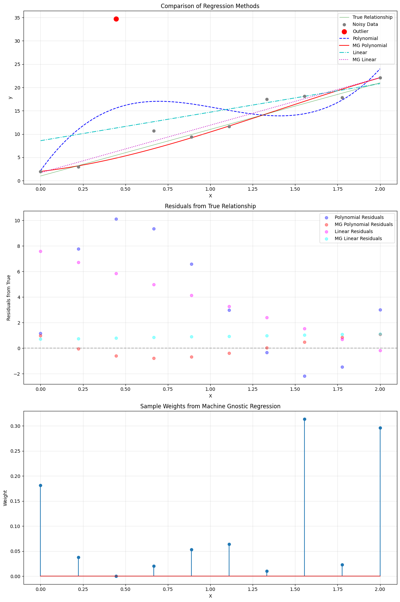

# LinearRegressor: Robust Linear Regression with Machine Gnostics

**LinearRegressor** is a robust linear regression model built on the Machine Gnostics framework. Unlike traditional statistical models that rely on probabilistic assumptions, this model uses algebraic and geometric structures to provide deterministic, resilient, and interpretable regression for real-world data.

---

## Overview

The Machine Gnostics LinearRegressor is designed for robust regression tasks, especially where data may contain outliers, noise, or non-Gaussian distributions. It leverages the core principles of Mathematical Gnostics (MG) to deliver reliable results even in challenging scenarios.

- **Deterministic & Finite:** No randomness or probability; all computations are reproducible.
- **Event-Level Modeling:** Handles uncertainty and error at the level of individual data events.
- **Algebraic Inference:** Utilizes gnostic algebra and error geometry for robust learning.
- **Resilient:** Designed to be robust against outliers, corrupted data, and distributional shifts.
- **Flexible:** Supports numpy arrays, pandas DataFrames, and pyspark DataFrames.
- **mlflow Integration:** For experiment tracking and deployment.
- **Easy Model Persistence:** Save and load models with joblib.

---

## Key Features

- **Fits a linear regression model (polynomial degree = 1)**
- **Least squares estimation for coefficient calculation**
- **Robust to outliers and non-Gaussian noise**
- **Training history tracking for analysis and visualization**
- **Customizable loss functions and scaling strategies**

---

## Parameters

| Parameter          | Type            | Default | Description                                                                   |
| ------------------ | --------------- | ------- | ----------------------------------------------------------------------------- |
| `max_iter`       | int             | 100     | Maximum number of training iterations.                                        |
| `tol`            | float           | 1e-3    | Convergence threshold for loss or coefficient changes.                        |
| `mg_loss`        | str             | 'hi'    | Type of gnostic loss:`'hi'` (estimation relevance), `'hj'` (irrelevance). |
| `early_stopping` | bool or int     | True    | Enables early stopping or sets window size.                                   |
| `verbose`        | bool            | False   | Prints progress and debug information.                                        |
| `scale`          | {'auto', float} | 'auto'  | Scaling strategy for the gnostic loss.                                        |
| `history`        | bool            | True    | Records training history at each iteration.                                   |
| `data_form`      | str             | 'a'     | Input data form:`'a'` (additive), `'m'` (multiplicative).                 |

---

## Attributes

- **coefficients**: `ndarray`Final learned regression coefficients.
- **weights**: `ndarray`Final sample weights after convergence.
- **_history**: `list of dict`
  Training history, including iteration, loss, coefficients, rentropy, and weights.

---

## Methods

### `fit(X, y)`

Fits the model to training data using polynomial expansion and gnostic loss minimization.

- **X**: array-like, shape (n_samples, n_features)Input features (numpy, pandas, or pyspark DataFrame).
- **y**: array-like, shape (n_samples,)
  Target values.

### `predict(X)`

Predicts output values for new input samples using the trained model.

- **X**: array-like, shape (n_samples, n_features)Input features for prediction.
- **Returns**:
  `y_pred`: ndarray, shape (n_samples,)
  Predicted target values.

### `save_model(path)`

Saves the trained model to disk using joblib.

- **path**: str
  Directory path to save the model.

### `load_model(path)`

Loads a previously saved model from disk.

- **path**: strDirectory path where the model is saved.
- **Returns**:
  Instance of `LinearRegressor` with loaded parameters.

---

## Example Usage

```python
from machinegnostics.models import LinearRegressor

# Initialize the model
model = LinearRegressor(max_iter=200, mg_loss='hi', verbose=True)

# Fit the model
model.fit(X_train, y_train)

# Predict
y_pred = model.predict(X_test)

# Access coefficients
print("Coefficients:", model.coefficients)

# Save the model
model.save_model("my_model_dir/")

# Load the model
loaded_model = LinearRegressor.load_model("my_model_dir/")
```

---

## Training History

The model records training history at each iteration, accessible via `model._history`.Each entry contains:

- `iteration`: Iteration number
- `h_loss`: Gnostic loss value
- `coefficients`: Regression coefficients at this iteration
- `rentropy`: Rentropy value
- `weights`: Sample weights at this iteration

This enables detailed analysis and visualization of the training process.

---

## Example

Machine Gnostic Linear Regression example notebooks: 

- [Example 1](https://github.com/MachineGnostics/machinegnostics.io/blob/main/examples/example_1_wine_data_linreg.ipynb)

- [Example 2](https://github.com/MachineGnostics/machinegnostics.io/blob/main/examples/example_1_1_small_data_linreg.ipynb)



---

## Notes

- The model is robust to outliers and suitable for datasets with non-Gaussian noise.
- Supports integration with mlflow for experiment tracking and deployment.
- For more information, visit: [https://machinegnostics.info/](https://machinegnostics.info/)
- Source code: [https://github.com/MachineGnostics/machinegnostics](https://github.com/MachineGnostics/machinegnostics)

---

## License

Machine Gnostics - Machine Gnostics Library
Copyright (C) 2025  Machine Gnostics Team

This work is licensed under the terms of the GNU General Public License version 3.0.

**Author:** Nirmal Parmar
**Date:** 2025-10-01

---
