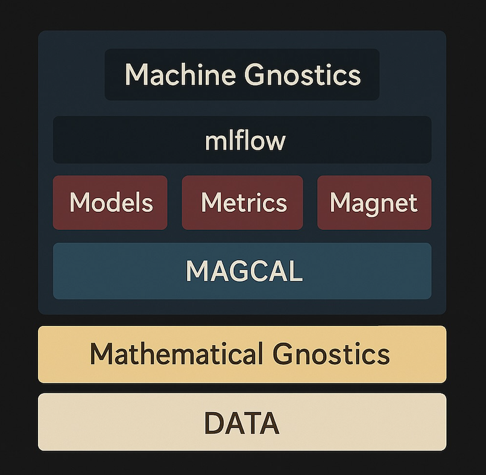

# Machine Gnostics Architecture

This diagram presents the conceptual architecture of the **Machine Gnostics** paradigm. Unlike traditional machine learning rooted in statistical theory, this new approach is built on the foundation of **Mathematical Gnostics (MG)**—a finite, deterministic, and physically inspired framework.

<!-- 

  

 -->

---

## 1. DATA

The foundation of Machine Gnostics is **DATA**, interpreted differently from statistical frameworks:

- Each data point is a **real event** with **individual importance and uncertainty**.
- No reliance on large sample assumptions or population-level abstractions.
- Adheres to the principle: _“Let the data speak for themselves.”_

---

## 2. Mathematical Gnostics

This is the **theoretical base** of the system. It replaces the assumptions of probability with deterministic modeling:

- Uses **Riemannian geometry**, **Einsteinian relativity**, **vector bi-algebra**, and **thermodynamics**.
- Models uncertainty at the level of **individual events**, not populations.
- Establishes a **finite theory** for **finite data**, with robust treatment of variability.

---

## 3. MAGCAL (Mathematical Gnostics Calculations)

MAGCAL is the computational engine that enables gnostic inference:

- Performs **deterministic, non-statistical** calculations.
- Enables **robust modeling** using gnostic algebra and error geometry.
- Resilient to outliers, corrupted data, and distributional shifts.

---

## 4. Models | Metrics | Magnet

This layer maps to familiar components of ML pipelines but with MG-specific logic:

- **Models:** Developed on the principles of Mathematical Gnostics.
- **Metrics:** Evaluate using **gnostic loss functions** and **event-level error propagation**.
- **Magnet:** A novel neural architecture based on **Mathematical Gnostics**

---

## 5. mlflow Integration

Despite its theoretical novelty, Machine Gnostics fits smoothly into modern ML workflows:

- **mlflow** provides tracking, model registry, and reproducibility.
- Ensures that experiments and deployments align with standard ML practices.

---

## 6. Machine Gnostics (Integration Layer for Machine Learning)

This layer unifies all components into a working system:

- **MAGCAL** is a Mathematical Gnostics based engine.
- Functions as a **complete ML framework** based on a deterministic, finite, and algebraic paradigm.
- Enables seamless data-to-model pipelines rooted in the principles of Mathematical Gnostics.

---

## Summary
!!! info "Quick Understanding"

    | Traditional ML (Statistics)        | Machine Gnostics                         |
    |------------------------------------|------------------------------------------|
    | Based on probability theory        | Based on deterministic finite theory     |
    | Relies on large datasets           | Works directly with small datasets       |
    | Uses averages and distributions    | Uses individual error and event modeling |
    | Rooted in Euclidean geometry       | Rooted in Riemannian geometry & physics  |
    | Vulnerable to outliers             | Robust to real-world irregularities      |

---

## [References](https://machinegnostics.info/references/)

> Machine Gnostics is not just an alternative—it is a **new foundation** for AI, capable of **rational, robust, and interpretable** data modeling.

---