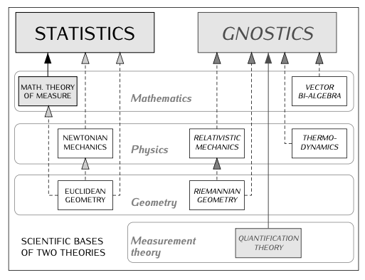
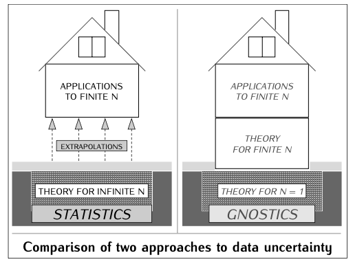

# Foundations of Mathematical Gnostics

!!! abstract
    **Mathematical Gnostics (MG)** offers a fundamentally different approach to data analysis and uncertainty compared to traditional mathematical statistics. Understanding these differences is crucial for users of the Machine Gnostics library, as it shapes the philosophy, algorithms, and practical outcomes of gnostic-based data analysis.

---

## Key Differences Between Statistics and Gnostics

=== "1. Focus on the Individual Event"

    - **Statistics:** Traditional statistics investigates the regularities and properties of large collections of uncertain events, relying on the Law of Large Numbers and the Central Limit Theorem. The theory is built for infinite or very large sample sizes, and results for finite datasets are often extrapolated from these infinite models.
    - **Gnostics:** MG concentrates on the uncertainty of a single event. It builds mathematical and physical models that directly address finite (even small) collections of uncertain events. This approach is more natural for real-world scenarios, where data is always finite.

=== "2. Treatment of Data & Uncertainty"

    - **Statistics:** Assumes the existence of a mean and standard deviation for an underlying probability distribution. Data is often treated as samples from an idealized random process, and analysis is based on population-level properties.
    - **Gnostics:** Treats each data point as an image of a real, existing event governed by the laws of nature. MG respects the actual values of the data, following the principle: **“Let data speak for themselves.”** The weight or importance of each data item is determined by its own individual error, not by its class or family.

=== "3. Math & Physical Foundations"

    - **Statistics:** Relies primarily on Euclidean geometry and Newtonian mechanics, with mathematical theory of measure as its foundation.
    - **Gnostics:** Utilizes Riemannian geometry and Einstein’s relativistic mechanics, along with vector bi-algebra and thermodynamics. MG also introduces quantification theory as a foundational measurement theory.

=== "4. Aggregation & Analysis"

    - **Statistics:** Aggregates observed data additively, focusing on population-level summaries.
    - **Gnostics:** Suggests that additive aggregation should be applied to the parameters of the Ideal Gnostic Cycle, not directly to the observed data.

---

## Scientific Bases: A Comparative Diagram

<figure markdown>
  
  <figcaption>The scientific foundations of statistics (left) and gnostics (right) span mathematics, physics, geometry, and measurement theory, but differ fundamentally in their approach and underlying principles. [Pavel Kovanic, <em>Mathematical Gnostics</em> (2023)]</figcaption>
</figure>

---

## Approaches to Data Uncertainty

<figure markdown>
  
  <figcaption>Statistics builds its theory for infinite sample sizes and extrapolates results for finite datasets. Gnostics, in contrast, constructs its theory directly for finite (even single) events, providing a more natural fit for real-world data. [Pavel Kovanic, <em>Mathematical Gnostics</em> (2023)]</figcaption>
</figure>

---

!!! info "Paradigm Shift: From Statistics to Gnostics"
    Mathematical gnostics represents a **paradigm shift** in how we approach data variability and analysis:

    - **Statistics** is rooted in the behavior of large numbers and infinite limits, often requiring extrapolation to address finite datasets.
    - **Gnostics** is designed for the finite world, modeling uncertainty at the level of individual events and small datasets.

    This shift requires a new way of thinking, much like moving from Newtonian to Einsteinian physics. While statistics is easily demonstrated with simple experiments (like coin tosses), the power of gnostics is revealed through its algorithms and their performance on real-world, finite data.

---

## Principles of the Gnostic Paradigm

- **Concentration on Individual Events:**  
  MG focuses on the regularities and uncertainty of individual events, not just large populations.
- **Respect for Data Values:**  
  Data is taken as it is, with each value carrying its own information and uncertainty.
- **Use of Advanced Geometry and Mechanics:**  
  MG employs Riemannian geometry and relativistic mechanics, providing a richer mathematical framework for modeling uncertainty.
- **Individual Error Weighting:**  
  The importance of each data point is determined by its own error, not by group-level properties.

---

## Why Adopt the Gnostic Approach?

!!! success "Advantages"
    - **Natural Fit for Finite Data:** Real-world data is always finite. MG provides tools and theory that are directly applicable without relying on extrapolation from infinite models.
    - **Robustness:** By focusing on individual data points and their uncertainties, MG offers greater resilience to outliers and corrupted data.
    - **Paradigm-Changing Power:** MG overcomes many limitations of traditional statistics, especially in cases where statistical assumptions break down.

---

## Further Reading

!!! note "Literature"
    For a deeper dive into the foundations and applications of mathematical gnostics, see:

    - Pavel Kovanic, *Mathematical Gnostics* (2023)
    - Pavel Kovanic & M.B. Humber, *The Economics of Information: Mathematical Gnostics for Data Analysis* (2015)

---

> Mathematical Gnostics is a new paradigm for data analysis—one that respects the individuality of data, leverages advanced mathematics, and is designed for the finite, real world.
