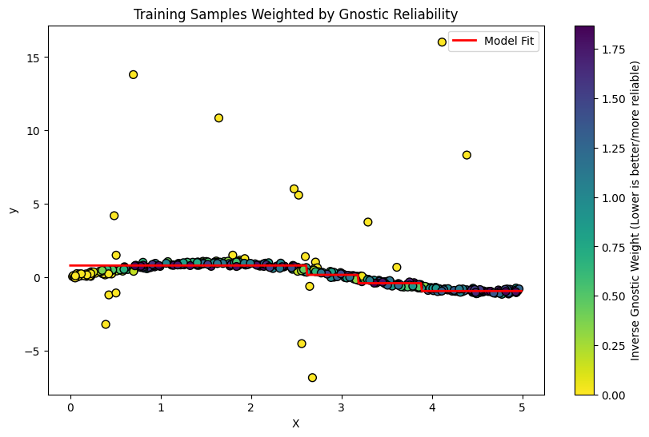

# GnosticDecisionTreeRegressor: Robust Decision Tree with Machine Gnostics

The `GnosticDecisionTreeRegressor` implements a single Decision Tree Regressor enhanced with iterative gnostic reweighting. It is designed to handle outliers and varying data quality by identifying and down-weighting samples with high gnostic residual or uncertainty, fitting a robust model directly to the data.

---

## Overview

Machine Gnostics `GnosticDecisionTreeRegressor` combines the interpretability of decision trees with the robustness of Mathematical Gnostics. It iteratively refines sample weights based on regression residuals to improve prediction accuracy in the presence of noise and outliers.

- **Robust Single Tree:** Fits a decision tree that is robust to outliers by down-weighting them.
- **Iterative Refinement:** Updates sample weights based on residuals over multiple iterations.
- **Interpretable:** Maintains the interpretability of a single decision tree.
- **Data Quality Handling:** Automatically adjusts to data with outliers or non-Gaussian noise.
- **Event-Level Modeling:** Handles uncertainty at the level of individual data events.
- **Easy Model Persistence:** Save and load models with joblib.

---

## Key Features

- Robust regression using iterative gnostic reweighting
- Iterative refinement of sample weights
- Configurable tree depth and splitting criteria
- Identifies and handles outliers automatically
- Convergence-based early stopping
- Training history tracking for analysis
- Compatible with numpy arrays for input/output

---

## Parameters

| Parameter | Type | Default | Description |
| :--- | :--- | :--- | :--- |
| `max_depth` | `int` | `None` | Maximum depth of the tree. |
| `min_samples_split` | `int` | `2` | Minimum samples to split a node. |
| `gnostic_weights` | `bool` | `True` | Whether to use iterative gnostic weights. |
| `max_iter` | `int` | `10` | Maximum gnostic iterations. |
| `tolerance` | `float` | `1e-4` | Convergence tolerance. |
| `data_form` | `str` | `'a'` | Data form: 'a' (additive) or 'm' (multiplicative). |
| `verbose` | `bool` | `False` | Verbosity. |
| `random_state` | `int` | `None` | Random seed. |
| `history` | `bool` | `True` | Whether to record training history. |
| `scale` | `str` | `'auto'` | Scaling method for input features. |
| `early_stopping` | `bool` | `True` | Whether to stop training early if convergence is detected. |

---

## Attributes

- **gnostic_weights**: `bool`
    - Whether iterative gnostic weights were used.
- **max_depth**: `int`
    - Maximum depth of the tree.
- **max_iter**: `int`
    - Maximum number of iterations used.
- **_history**: `list`
    - List of dictionaries containing training history (if enabled).
- **tolerance, data_form, verbose, random_state, scale, early_stopping**
    - Configuration parameters as set at initialization.

---

## Methods

### `fit(X, y)`

Fit the model to the data.

This method trains the decision tree regressor using the provided input features and target values. If `gnostic_weights` is True, it iteratively refines the model by reweighting samples based on gnostic residuals.

**Parameters**

- **X**: `np.ndarray` of shape `(n_samples, n_features)`
    - Input features.
- **y**: `np.ndarray` of shape `(n_samples,)`
    - Target values.

**Returns**

- **self**: `GnosticDecisionTreeRegressor`
    - Returns the fitted model instance for chaining.

---

### `predict(model_input)`

Predict outcomes for new data.

**Parameters**

- **model_input**: `np.ndarray` of shape `(n_samples, n_features)`
    - Input data for prediction.

**Returns**

- **y_pred**: `np.ndarray` of shape `(n_samples,)`
    - Predicted target values.

---

### `score(X, y)`

Compute the robust (gnostic) R² score for the model.

**Parameters**

- **X**: `np.ndarray` of shape `(n_samples, n_features)`
    - Input features for evaluation.
- **y**: `np.ndarray` of shape `(n_samples,)`
    - True target values.

**Returns**

- **score**: `float`
    - Robust R² score of the model.

---

### `save(path)`

Saves the trained model to disk using joblib.

- **path**: str
  Directory path to save the model.

---

### `load(path)`

Loads a previously saved model from disk.

- **path**: str
  Directory path where the model is saved.

**Returns**

Instance of `GnosticDecisionTreeRegressor` with loaded parameters.

---

## Example Usage

=== "Python"

    ```python
    import numpy as np
    from machinegnostics.models import GnosticDecisionTreeRegressor

    # Generate synthetic data with outliers
    np.random.seed(42)
    X = np.random.rand(100, 1) * 10
    # True relation: y = 2x + 1
    y = 2 * X.ravel() + 1 + np.random.normal(0, 0.5, 100)
    # Add strong outliers
    y[::10] += 20  
    
    # Initialize and fit the robust tree model
    model = GnosticDecisionTreeRegressor(
        max_depth=5,
        gnostic_weights=True,
        max_iter=10,
        verbose=True
    )
    model.fit(X, y)

    # Make predictions
    preds = model.predict(X[:5])
    print("Predictions:", preds)
    
    # Score
    r2 = model.score(X, y)
    print(f"Robust R2: {r2:.4f}")
    ```

=== "Example Output"

    
    

---

## Training History

If `history=True`, the model records detailed training history at each iteration, accessible via `model._history`. This is particularly useful when `gnostic_weights=True` to observe how sample weights evolve over iterations.

---

## Notes

- This model is resilient to outliers due to the iterative gnostic reweighting mechanism.
- Provides interpretability similar to a standard decision tree but with enhanced robustness.

---

**Author:** Nirmal Parmar 
