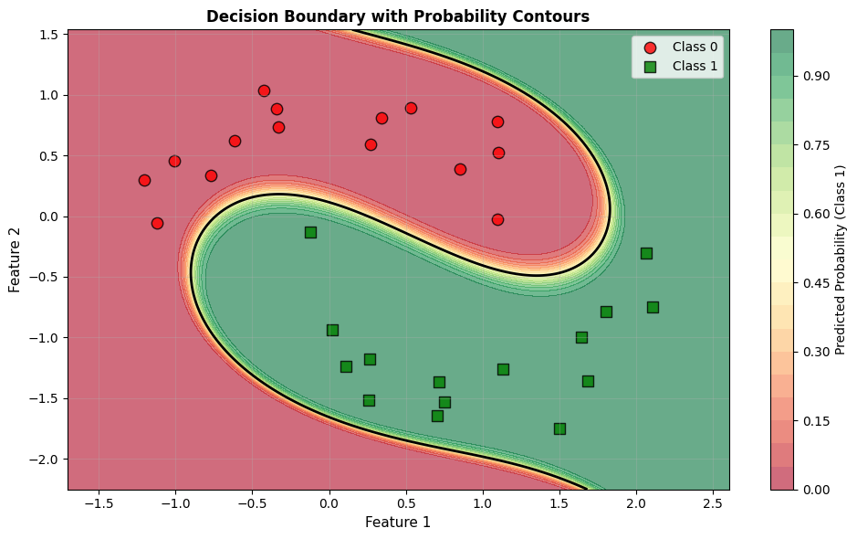

# LogisticRegressor: Robust Logistic Regression with Machine Gnostics

The `LogisticRegressor` is a robust logistic regression model built on the Machine Gnostics framework. It provides feature-rich binary classification with polynomial feature expansion, custom loss functions, and detailed history tracking, designed to be resilient to outliers and non-Gaussian noise.

---

## Overview

Machine Gnostics `LogisticRegressor` brings deterministic, event-level modeling to binary classification. By leveraging gnostic algebra and geometry, it provides robust, interpretable, and reproducible results, even in challenging scenarios.

- **Deterministic & Finite:** No randomness or probability; all computations are reproducible.
- **Event-Level Modeling:** Handles uncertainty and error at the level of individual data events.
- **Robust:** Designed to be robust against outliers, corrupted data, and distributional shifts.
- **Flexible:** Supports polynomial feature expansion and multiple probability estimation methods.
- **mlflow Integration:** For experiment tracking and deployment.
- **Easy Model Persistence:** Save and load models with joblib.

---

## Key Features

- Fits a logistic regression model for binary classification
- Polynomial feature expansion up to a user-specified degree
- Robust to outliers and non-Gaussian noise
- Choice of probability estimation method: 'gnostic' or standard 'sigmoid'
- Iterative optimization with early stopping and convergence tolerance
- Adaptive sample weighting
- Training history tracking for analysis and visualization
- Compatible with numpy arrays for input/output

---

## Parameters

| Parameter | Type | Default | Description |
| :--- | :--- | :--- | :--- |
| `degree` | `int` | `1` | Degree of polynomial features to use for input expansion. |
| `max_iter` | `int` | `100` | Maximum number of iterations for the optimization algorithm. |
| `tolerance` | `float` | `1e-2` | Tolerance for convergence. |
| `early_stopping` | `bool` | `True` | Whether to stop training early if convergence is detected. |
| `verbose` | `bool` | `False` | If True, prints detailed logs during training. |
| `scale` | `str` \| `int` \| `float` | `'auto'` | Scaling method for input features. |
| `data_form` | `str` | `'a'` | Internal data representation format. |
| `gnostic_characteristics` | `bool` | `False` | If True, computes and records gnostic characteristics. |
| `history` | `bool` | `True` | If True, records the optimization history for analysis. |

---

## Attributes

- **coefficients**: `np.ndarray`
    - Fitted model coefficients after training.
- **weights**: `np.ndarray`
    - Sample weights used during training.
- **params**: `list of dict`
    - List of model parameters (for compatibility and inspection).
- **_history**: `list`
    - List of dictionaries containing training history (loss, coefficients, entropy, etc.).
- **degree, max_iter, tolerance, early_stopping, verbose, scale, data_form, gnostic_characteristics**
    - Configuration parameters as set at initialization.

---

## Methods

### `fit(X, y)`

Fit the logistic regression model to the data.

This method trains the logistic regression model using the provided input features and target labels. It supports polynomial feature expansion and early stopping based on convergence criteria.

**Parameters**

- **X**: `array-like` or `DataFrame` of shape `(n_samples, n_features)`
    - Input features for training.
- **y**: `array-like` of shape `(n_samples,)`
    - Target labels for training (binary 0 or 1).

**Returns**

- **self**: `LogisticRegressor`
    - Returns the fitted model instance for chaining.

---

### `predict(model_input)`

Predict class labels for new data.

**Parameters**

- **model_input**: `array-like` or `DataFrame` of shape `(n_samples, n_features)`
    - Input data for prediction.

**Returns**

- **y_pred**: `np.ndarray` of shape `(n_samples,)`
    - Predicted class labels (0 or 1).

---

### `predict_proba(model_input)`

Predict class probabilities for new data.

**Parameters**

- **model_input**: `array-like` or `DataFrame` of shape `(n_samples, n_features)`
    - Input data for probability prediction.

**Returns**

- **y_proba**: `np.ndarray` of shape `(n_samples,)`
    - Predicted probabilities for the positive class.

---

### `score(X, y)`

Compute the F1 score of the model on given data.

**Parameters**

- **X**: `array-like` or `DataFrame` of shape `(n_samples, n_features)`
    - Input features for evaluation.
- **y**: `array-like` of shape `(n_samples,)`
    - True binary labels.

**Returns**

- **score**: `float`
    - F1 score of the model predictions.

---

### `save(path)`

Saves the trained model to disk using joblib.

- **path**: str
  Directory path to save the model.

---

### `load(path)`

Loads a previously saved model from disk.

- **path**: str
  Directory path where the model is saved.

**Returns**

Instance of `LogisticRegressor` with loaded parameters.

---

## Example Usage

=== "Python"

    ```python
    import numpy as np
    from machinegnostics.models import LogisticRegressor

    # Generate two-moons dataset (non-linearly separable)
    def make_moons(n_samples=30, noise=0.15):
        n_samples_out = n_samples // 2
        n_samples_in = n_samples - n_samples_out
        
        # First moon
        outer_circ_x = np.cos(np.linspace(0, np.pi, n_samples_out))
        outer_circ_y = np.sin(np.linspace(0, np.pi, n_samples_out))
        
        # Second moon
        inner_circ_x = 1 - np.cos(np.linspace(0, np.pi, n_samples_in))
        inner_circ_y = -np.sin(np.linspace(0, np.pi, n_samples_in)) - 0.5
        
        X = np.vstack([
            np.stack([outer_circ_x, outer_circ_y], axis=1),
            np.stack([inner_circ_x, inner_circ_y], axis=1)
        ])
        y = np.array([0] * n_samples_out + [1] * n_samples_in)
        
        # Add noise
        X += np.random.normal(scale=noise, size=X.shape)
        
        return X, y

    # Fit the model with polynomial features (degree=3 for non-linear boundary)
    model = LogisticRegressor(degree=3, verbose=False, early_stopping=True, tolerance=0.001)
    model.fit(X, y)

    # Make predictions
    y_pred = model.predict(X)
    y_proba = model.predict_proba(X)
    ```

=== "Plot"

    ```python
    import matplotlib.pyplot as plt

    # Create decision boundary plot
    x_min, x_max = X[:, 0].min() - 0.5, X[:, 0].max() + 0.5
    y_min, y_max = X[:, 1].min() - 0.5, X[:, 1].max() + 0.5
    xx, yy = np.meshgrid(np.linspace(x_min, x_max, 200),
                        np.linspace(y_min, y_max, 200))

    # Predict on grid
    grid = np.c_[xx.ravel(), yy.ravel()]
    Z = model.predict_proba(grid)
    Z = Z.reshape(xx.shape)

    # Plot
    plt.figure(figsize=(10, 6))
    plt.contourf(xx, yy, Z, levels=20, cmap='RdYlGn', alpha=0.6)
    plt.colorbar(label='Predicted Probability (Class 1)')
    plt.contour(xx, yy, Z, levels=[0.5], colors='black', linewidths=2)

    # Plot data points
    plt.scatter(X[y==0, 0], X[y==0, 1], c='red', s=80, edgecolors='k', 
                label='Class 0', marker='o', alpha=0.8)
    plt.scatter(X[y==1, 0], X[y==1, 1], c='green', s=80, edgecolors='k', 
                label='Class 1', marker='s', alpha=0.8)

    plt.xlabel('Feature 1', fontsize=11)
    plt.ylabel('Feature 2', fontsize=11)
    plt.title('Decision Boundary with Probability Contours', fontsize=12, fontweight='bold')
    plt.legend()
    plt.grid(True, alpha=0.3)
    plt.tight_layout()
    plt.show()

    ```

=== "Output"

    

---

## Training History

If `history=True`, the model records detailed training history at each iteration, accessible via `model.params` and `model._history`. Each entry contains details like loss, coefficients, and entropy, enabling in-depth analysis of the learning process.

---

## Notes

- The model supports only binary classification tasks.
- More information on gnostic characteristics can be found in the Machine Gnostics documentation.

---

**Author:** Nirmal Parmar
