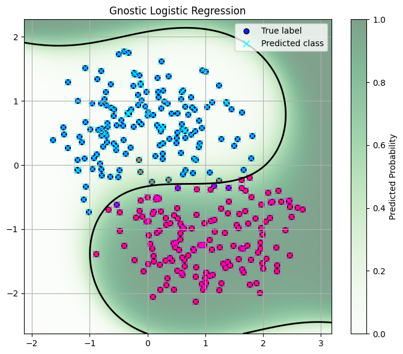

# LogisticRegressor: Robust Logistic Regression with Machine Gnostics

The `LogisticRegressor` is a robust and flexible binary classification model built on the Machine Gnostics framework. It is designed to handle outliers, heavy-tailed distributions, and non-Gaussian noise, making it suitable for real-world data challenges. The model supports polynomial feature expansion, robust weighting, early stopping, and seamless MLflow integration for experiment tracking and deployment.

---

## Overview

Machine Gnostics LogisticRegressor brings deterministic, event-level modeling to binary classification. By leveraging gnostic algebra and geometry, it provides robust, interpretable, and reproducible results, even in challenging scenarios.

**Highlights:**

- **Outlier Robustness:** Gnostic weighting reduces the impact of noisy or corrupted samples.
- **Polynomial Feature Expansion:** Configurable degree for nonlinear decision boundaries.
- **Flexible Probability Output:** Choose between gnostic-based or standard sigmoid probabilities.
- **Early Stopping:** Efficient training via monitoring of loss and entropy.
- **MLflow Integration:** Supports experiment tracking and deployment.
- **Model Persistence:** Save and load models easily with joblib.

---

## Key Features

- Robust to outliers and non-Gaussian noise
- Polynomial feature expansion (configurable degree)
- Flexible probability output: gnostic or sigmoid
- Customizable data scaling (auto or manual)
- Early stopping based on residual entropy or log loss
- Full training history tracking (loss, entropy, coefficients, weights)
- MLflow integration for model tracking and deployment
- Save and load model using joblib

---

## Parameters

| Parameter          | Type                  | Default   | Description                                                   |
|--------------------|----------------------|-----------|---------------------------------------------------------------|
| `degree`           | int                  | 1         | Degree of the polynomial for feature expansion (1 = linear).  |
| `max_iter`         | int                  | 100       | Maximum number of training iterations.                        |
| `tol`              | float                | 1e-3      | Convergence threshold for loss or coefficient changes.        |
| `scale`            | {'auto', float}      | 'auto'    | Scaling mode for gnostic transformation.                      |
| `early_stopping`   | bool                 | True      | Enables early stopping based on convergence criteria.         |
| `history`          | bool                 | True      | Records training history at each iteration.                   |
| `proba`            | {'gnostic','sigmoid'}| 'gnostic' | Probability output mode.                                      |
| `verbose`          | bool                 | False     | Prints progress and debug information.                        |
| `data_form`        | str                  | 'a'       | Input data form: `'a'` (additive), `'m'` (multiplicative).    |
| `verbose`           | bool                  | True      | Print detailed progress, warnings, and results                   |

---

## Attributes

- **coefficients**: `ndarray`  
  Final learned polynomial regression coefficients.
- **weights**: `ndarray`  
  Final sample weights after convergence.
- **_history**: `list of dict`  
  Training history, including loss, entropy, coefficients, and weights at each iteration.

---

## Methods

### `fit(X, y)`

Fits the model to training data using polynomial expansion and robust loss minimization.

- **X**: array-like, pandas.DataFrame, or numpy.ndarray of shape `(n_samples, n_features)`  
  Training input samples.
- **y**: array-like or numpy.ndarray of shape `(n_samples,)`  
  Target binary labels (0 or 1).

**Returns:**  
`self` (for method chaining)

---

### `predict(X)`

Predicts class labels (0 or 1) for new input samples using the trained model.

- **X**: array-like, pandas.DataFrame, or numpy.ndarray of shape `(n_samples, n_features)`  
  Input samples for prediction.

**Returns:**  
`y_pred`: numpy.ndarray of shape `(n_samples,)`  
Predicted binary class labels.

---

### `predict_proba(X)`

Predicts probabilities for new input samples using the trained model.

- **X**: array-like, pandas.DataFrame, or numpy.ndarray of shape `(n_samples, n_features)`  
  Input samples for probability prediction.

**Returns:**  
`proba`: numpy.ndarray of shape `(n_samples,)`  
Predicted probabilities for the positive class (label 1).

---

### `save_model(path)`

Saves the trained model to disk using joblib.

- **path**: str  
  Directory path to save the model.

---

### `load_model(path)`

Loads a previously saved model from disk.

- **path**: str  
  Directory path where the model is saved.

**Returns:**  
Instance of `LogisticRegressor` with loaded parameters.

---

## Example Usage

```python
from machinegnostics.models.classification import LogisticRegressor

# Initialize the model
model = LogisticRegressor(degree=2, proba='gnostic', verbose=True)

# Fit the model
model.fit(X_train, y_train)

# Predict class labels
y_pred = model.predict(X_test)

# Predict probabilities
y_proba = model.predict_proba(X_test)

# Access coefficients and weights
print("Coefficients:", model.coefficients)
print("Weights:", model.weights)

# Save the model
model.save_model("my_logreg_model")

# Load the model
loaded = LogisticRegressor.load_model("my_logreg_model")
y_pred2 = loaded.predict(X_test)
```

---

## Training History

If `history=True`, the model records training history at each iteration, accessible via `model._history`. Each entry contains:

- `iteration`: Iteration number
- `loss`: Loss value (gnostic or log loss)
- `entropy`: Residual entropy value
- `coefficients`: Regression coefficients at this iteration
- `weights`: Sample weights at this iteration

This enables detailed analysis and visualization of the training process.

---

## Example Notebooks

- [Example 1](https://github.com/MachineGnostics/machinegnostics.io/blob/main/examples/example_3_moon_data_logreg.ipynb)
- [Example 2](https://github.com/MachineGnostics/machinegnostics.io/blob/main/examples/example_4_logreg_mlflow.ipynb)



---

## Notes

- The model supports numpy arrays, pandas DataFrames, and pyspark DataFrames as input.
- For best results, ensure input features are appropriately scaled and encoded.
- Supports integration with MLflow for experiment tracking and deployment.
<!-- - For more information, visit: [https://machinegnostics.info/](https://machinegnostics.info/) -->

---

**Author:** Nirmal Parmar  
**Date:** 2025-05-01

---