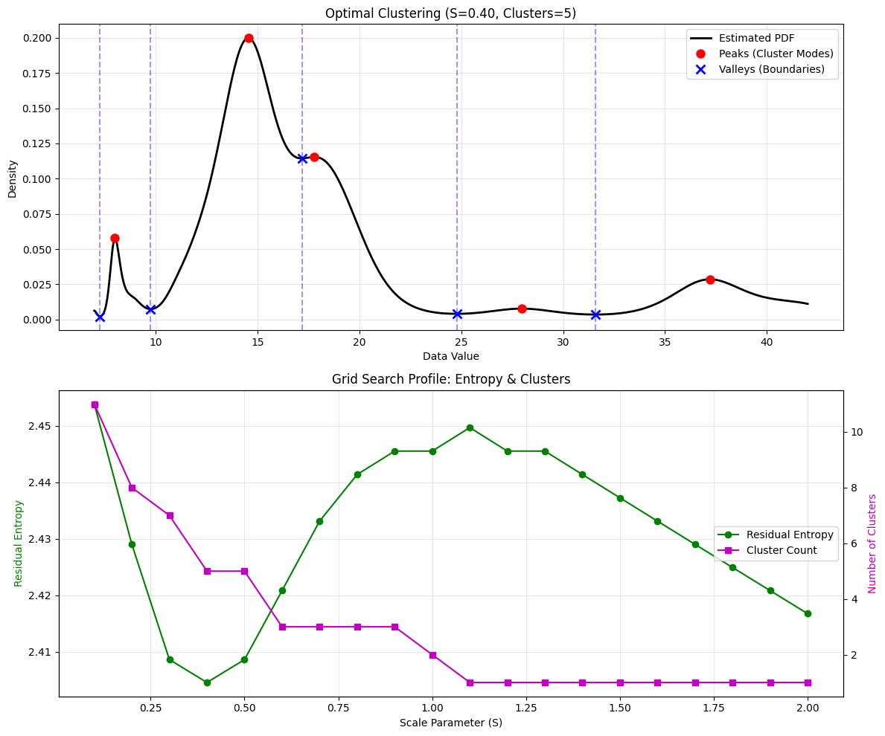

# GnosticLocalClustering: Density-Based Clustering

The `GnosticLocalClustering` model performs density-based clustering using **Estimating Local Distribution Functions (ELDF)**. Unlike distance-based methods like K-Means, this approach identifies clusters as high-density regions (modes) separated by low-density regions (valleys) in the estimated probability density function (PDF). This allows it to naturaly determine the number of clusters and handle non-convex cluster shapes.

---

## Overview

Machine Gnostics `GnosticLocalClustering` builds a continuous probability density Estimate (ELDF) of the data and analyzes its topology.
- **Peaks (Modes):** serve as cluster centroids.
- **Valleys (Minima):** serve as the boundaries between clusters.

It includes mechanisms to automatically determine the optimal scale parameter ($S$) which controls the "resolution" of the clustering, effectively deciding how detailed the cluster structure should be.

- **Automatic Cluster Detection:** No need to specify `n_clusters` beforehand; the model discovers them based on data density.
- **Density-Based:** Can separate clusters of arbitrary shape and density.
- **Robustness:** Inherits the robust properties of Gnostic Distribution Functions.
- **Interpretability:** Provides visualization of the underlying PDF, peaks, and boundaries.

!!! note "Dimensionality"
    Currently, `GnosticLocalClustering` is optimized for **1D data** (univariate clustering). If multi-dimensional data is provided, it is flattened.

---

## Key Features

- Density-based clustering using Gnostic ELDF
- Automatically determines the number of clusters
- Can search for optimal scale parameters (Grid Search or Auto)
- Identifies cluster boundaries (valleys) and centroids (peaks)
- Visualization method `plot()` included
- Robust to outliers
- Compatible with numpy arrays

---

## Parameters

| Parameter | Type | Default | Description |
| :--- | :--- | :--- | :--- |
| `start_S` | `float` | `0.1` | Starting value for scale parameter $S$ grid search. |
| `end_S` | `float` | `2.0` | Ending value for scale parameter $S$ grid search. |
| `step_S` | `float` | `0.1` | Step size for $S$. |
| `varS` | `bool` | `False` | Uses variable scale parameter (heteroscedasticity) if True. |
| `auto_S` | `bool` | `True` | If True, uses ELDF's internal auto-optimization for $S$. |
| `verbose` | `bool` | `False` | Verbosity mode. |
| `history` | `bool` | `True` | Record search history (S, entropy, clusters). |
| `data_form` | `str` | `'a'` | Data form: 'a' (additive) or 'm' (multiplicative). |

---

## Attributes

- **centroids**: `np.ndarray`
    - Detected cluster modes (peaks of the PDF).
- **cluster_boundaries**: `np.ndarray`
    - Detected boundaries between clusters (valleys of the PDF).
- **labels**: `np.ndarray`
    - Cluster labels for each sample.
- **optimal_S**: `float`
    - The scale parameter value ($S$) of the selected best model.
- **best_model**: `ELDF`
    - The fitted ELDF model object.
- **results**: `pd.DataFrame`
    - History of the grid search (S values, residual entropy, n_clusters).

---

## Methods

### `fit(X, y=None)`

Fit the density-based clustering model to the data.

This process involves:
1.  Running an optimization loop (Auto or Grid) to find the best Scale Parameter $S$.
2.  Estimating the PDF using ELDF.
3.  Identifying peaks (centroids) and valleys (boundaries).
4.  Minimizing Residual Entropy to select the best model.

**Parameters**

- **X**: `np.ndarray`
    - Input data. (Flattened if > 1D).
- **y**: `Ignored`
    - Not used.

**Returns**

- **self**: `GnosticLocalClustering`

---

### `predict(model_input)`

Predict cluster labels for new data. Labels are assigned based on which "valley-bounded" interval the data point falls into.

**Parameters**

- **model_input**: `np.ndarray`
    - New data to predict.

**Returns**

- **labels**: `np.ndarray`
    - Predicted cluster labels (integers 0, 1, ...).

---

### `score(X, y=None)`

Return the **Residual Entropy** of the fitted model.

Unlike K-Means inertia, this metric measures the "unexplained" information in the data given the distribution model. Lower is better.

**Parameters**

- **X**: `np.ndarray`
    - Input features.

**Returns**

- **score**: `float`
    - Residual entropy.

---

### `plot()`

Visualize the clustering results.

- Plots the estimated Gnostic PDF.
- Marks **Peaks** (Centroids) with red dots.
- Marks **Valleys** (Boundaries) with blue crosses and lines.
- If a grid search was performed, plots the Residual Entropy and Cluster Count vs $S$.

---

### `save(path)`

Saves the trained model to disk using joblib.

- **path**: str
  Directory path to save the model.

---

### `load(path)`

Loads a previously saved model from disk.

- **path**: str
  Directory path where the model is saved.

**Returns**

Instance of `GnosticLocalClustering` with loaded parameters.

---

## Example Usage

=== "Python"

    ```python
    import numpy as np
    from machinegnostics.models import GnosticLocalClustering

    # Generate multimodal data (3 mixed gaussians)
    np.random.seed(42)
    X = np.concatenate([
        np.random.normal(0, 0.5, 50),
        np.random.normal(5, 0.5, 50),
        np.random.normal(10, 0.5, 50)
    ])
    
    # Initialize using Auto-S optimization
    model = GnosticLocalClustering(auto_S=True, verbose=True)
    
    # Fit
    model.fit(X)
    
    # Inspect
    print(f"Optimal S: {model.optimal_S:.2f}")
    print(f"Detected Clusters: {model.n_clusters}")
    print(f"Centroids (Peaks): \n{model.centroids}")
    
    # Predict
    labels = model.predict(X[:5])
    print("Labels:", labels)
    
    # Plot results
    # model.plot() 
    ```

=== "Example Output"

    

---

## Notes

- **Scale Parameter ($S$):** This parameter is crucial. A small $S$ results in a jagged PDF with many peaks (over-clustering), while a large $S$ results in a smooth PDF with fewer peaks (under-clustering). The `auto_S=True` setting attempts to find an information-theoretic optimum.
- **Boundaries:** Data points exactly on a boundary (valley) are assigned to the cluster on the right (higher value).

---

**Author:** Nirmal Parmar 
