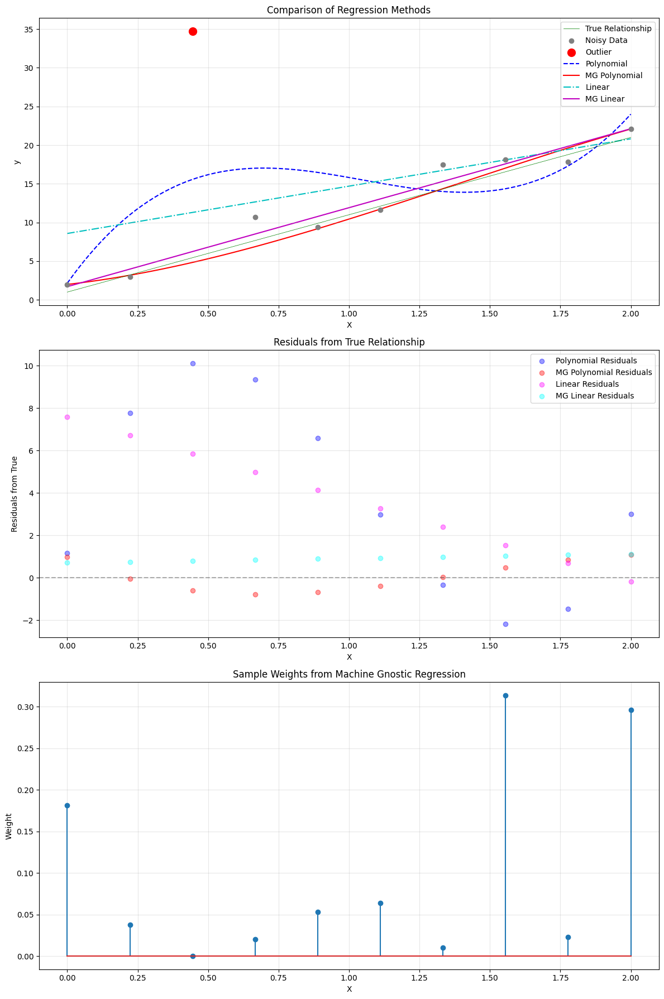

# LinearRegressor: Robust Linear Regression with Machine Gnostics

The `LinearRegressor` is a robust linear regression model built on the Machine Gnostics framework. Unlike traditional statistical models that rely on probabilistic assumptions, this model uses algebraic and geometric structures to provide deterministic, resilient, and interpretable regression for real-world data.

---

## Overview

The Machine Gnostics LinearRegressor is designed for robust regression tasks, especially where data may contain outliers, noise, or non-Gaussian distributions. It leverages the core principles of Mathematical Gnostics (MG) to deliver reliable results even in challenging scenarios.

- **Deterministic & Finite:** No randomness or probability; all computations are reproducible.
- **Event-Level Modeling:** Handles uncertainty and error at the level of individual data events.
- **Algebraic Inference:** Utilizes gnostic algebra and error geometry for robust learning.
- **Resilient:** Designed to be robust against outliers, corrupted data, and distributional shifts.
- **Flexible:** Supports numpy arrays, pandas DataFrames, and pyspark DataFrames.
- **mlflow Integration:** For experiment tracking and deployment.
- **Easy Model Persistence:** Save and load models with joblib.

---

## Key Features

- **Fits a linear regression model**
- **Robust to outliers and non-Gaussian noise**
- **Iterative optimization with early stopping and convergence tolerance**
- **Adaptive sample weighting using gnostic loss**
- **Training history tracking for analysis and visualization**
- **Customizable loss functions and scaling strategies**
- **Compatible with numpy arrays for input/output**

---

## Parameters

| Parameter                   | Type                 | Default | Description                                                      |
| --------------------------- | -------------------- | ------- | ---------------------------------------------------------------- |
| `scale`                   | {'auto', int, float} | 'auto'  | Scaling method or value for input features.                      |
| `max_iter`                | int                  | 100     | Maximum number of optimization iterations.                       |
| `tol`                     | float                | 1e-3    | Tolerance for convergence.                                       |
| `mg_loss`                 | str                  | 'hi'    | Gnostic loss function to use (`'hi'`, `'fi'`, etc.).         |
| `early_stopping`          | bool                 | True    | Whether to stop early if convergence is detected.                |
| `verbose`                 | bool                 | False   | If True, prints progress and diagnostics during fitting.         |
| `data_form`               | str                  | 'a'     | Internal data representation format.                             |
| `gnostic_characteristics` | bool                 | True    | If True, computes and records gnostic properties (fi, hi, etc.). |
| `history`                 | bool                 | True    | If True, records the optimization history for analysis.          |

---

## Attributes

- **coefficients**: `np.ndarray`Fitted linear regression coefficients.
- **weights**: `np.ndarray`Final sample weights after robust fitting.
- **params**: `list of dict`Parameter snapshots (loss, weights, gnostic properties) at each iteration.
- **_history**: `list`Internal optimization history (if enabled).
- **degree, max_iter, tol, mg_loss, early_stopping, verbose, scale, data_form, gnostic_characteristics**:
  Configuration parameters as set at initialization.

---

## Methods

### `fit(X, y)`

Fits the linear regressor to input features `X` and targets `y` using robust, gnostic loss minimization. Iteratively optimizes coefficients and sample weights, optionally recording history.

- **X**: `np.ndarray`, shape `(n_samples, n_features)`Input features.
- **y**: `np.ndarray`, shape `(n_samples,)`
  Target values.

**Returns:**
`self` (fitted model instance)

---

### `predict(X)`

Predicts target values for new input features using the trained model.

- **X**: `np.ndarray`, shape `(n_samples, n_features)`
  Input features for prediction.

**Returns:**
`y_pred`: `np.ndarray`, shape `(n_samples,)`
Predicted target values.

---

### `score(X, y, case='i')`

Computes the robust (gnostic) R² score for the linear regressor model.

- **X**: `np.ndarray`, shape `(n_samples, n_features)`Input features for scoring.
- **y**: `np.ndarray`, shape `(n_samples,)`True target values.
- **case**: `str`, default `'i'`
  Specifies the case or variant of the R² score to compute.

**Returns:**
`score`: `float`
Robust R² score of the model on the provided data.

---

### `save_model(path)`

Saves the trained model to disk using joblib.

- **path**: str
  Directory path to save the model.

---

### `load_model(path)`

Loads a previously saved model from disk.

- **path**: str
  Directory path where the model is saved.

**Returns:**
Instance of `LinearRegressor` with loaded parameters.

---

## Example Usage

```python
from machinegnostics.models.regression import LinearRegressor

# Initialize the model
model = LinearRegressor(max_iter=100, mg_loss='hi', verbose=True)

# Fit the model
model.fit(X_train, y_train)

# Predict
y_pred = model.predict(X_test)

# Score
r2 = model.score(X_test, y_test)
print(f"Robust R2 score: {r2}")

# Access coefficients and weights
print("Coefficients:", model.coefficients)
print("Weights:", model.weights)
```

---

## Training History

If `history=True`, the model records detailed training history at each iteration, accessible via `model.params` and `model._history`. Each entry contains:

- `iteration`: Iteration number
- `loss`: Gnostic loss value
- `coefficients`: Regression coefficients at this iteration
- `rentropy`: Rentropy value (residual entropy)
- `weights`: Sample weights at this iteration
- `gnostic_characteristics`: (if enabled) fi, hi, etc.

This enables in-depth analysis and visualization of the training process.

---

## Example Notebooks

- [Example 1](https://github.com/MachineGnostics/machinegnostics.io/blob/main/examples/example_1_wine_data_linreg.ipynb)
- [Example 2](https://github.com/MachineGnostics/machinegnostics.io/blob/main/examples/example_1_1_small_data_linreg.ipynb)



---

## Notes

- The model is robust to outliers and suitable for datasets with non-Gaussian noise.
- Supports integration with mlflow for experiment tracking and deployment.
- For more information, visit: [https://machinegnostics.info/](https://machinegnostics.info/)

---

**Author:** Nirmal Parmar   
**Date:** 2025-05-01

---
