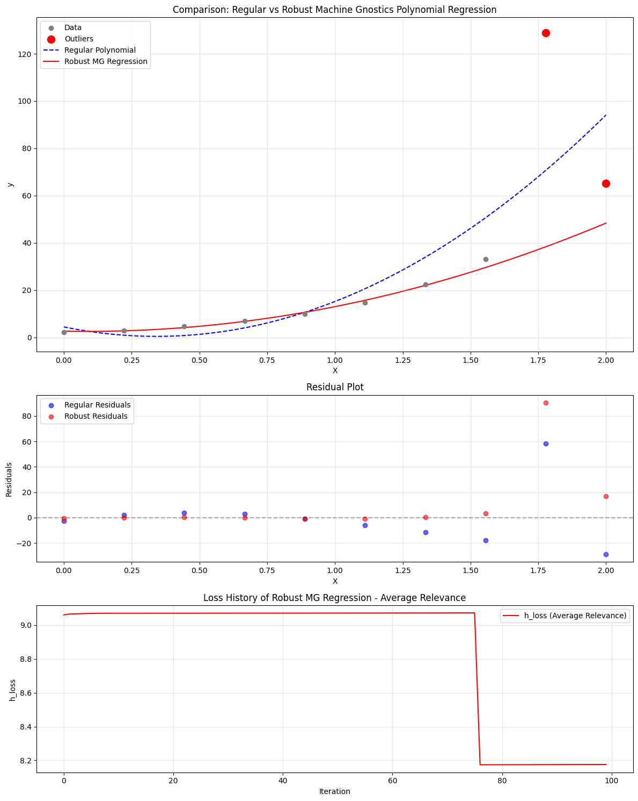

# PolynomialRegressor: Robust Polynomial Regression with Machine Gnostics

The `PolynomialRegressor` is a robust polynomial regression model built on the principles of Mathematical Gnostics. It is designed to provide deterministic, interpretable, and resilient regression in the presence of outliers, noise, and non-Gaussian data distributions. Unlike traditional statistical models, this regressor leverages algebraic and geometric concepts from Mathematical Gnostics, focusing on event-level modeling and robust loss minimization.

---

## Overview

- **Robust to Outliers:** Uses gnostic loss functions and adaptive weights to minimize the influence of outliers and corrupted samples.
- **Polynomial Feature Expansion:** Supports configurable polynomial degrees for flexible modeling.
- **Iterative Optimization:** Employs iterative fitting with early stopping and convergence checks.
- **Custom Gnostic Loss:** Minimizes a user-selected gnostic loss (`'hi'`, `'hj'`, etc.) for event-level robustness.
- **Detailed Training History:** Optionally records loss, weights, entropy, and gnostic characteristics at each iteration.
- **Easy Integration:** Compatible with numpy arrays and supports model persistence.

---

## Key Features

- **Robust regression using gnostic loss functions**
- **Flexible polynomial degree (linear and higher-order)**
- **Adaptive sample weighting**
- **Early stopping and convergence tolerance**
- **Training history tracking for analysis and visualization**
- **Handles non-Gaussian noise and outliers**
- **Compatible with numpy arrays**

---

## Parameters

| Parameter                | Type                | Default   | Description                                                                 |
|--------------------------|---------------------|-----------|-----------------------------------------------------------------------------|
| `degree`                 | int                 | 2         | Degree of the polynomial to fit.                                            |
| `scale`                  | {'auto', int, float}| 'auto'    | Scaling method or value for input features.                                 |
| `max_iter`               | int                 | 100       | Maximum number of optimization iterations.                                  |
| `tol`                    | float               | 1e-3      | Tolerance for convergence.                                                  |
| `mg_loss`                | str                 | 'hi'      | Gnostic loss function to use (`'hi'`, `'fi'`, etc.).                        |
| `early_stopping`         | bool                | True      | Whether to stop early if convergence is detected.                           |
| `verbose`                | bool                | False     | If True, prints progress and diagnostics during fitting.                    |
| `data_form`              | str                 | 'a'       | Internal data representation format.                                        |
| `gnostic_characteristics`| bool                | True      | If True, computes and records gnostic properties (fi, hi, etc.).            |
| `history`                | bool                | True      | If True, records the optimization history for analysis.                     |

---

## Attributes

- **coefficients**: `np.ndarray`  
  Fitted polynomial regression coefficients.
- **weights**: `np.ndarray`  
  Final sample weights after robust fitting.
- **params**: `list of dict`  
  Parameter snapshots (loss, weights, gnostic properties) at each iteration.
- **_history**: `list`  
  Internal optimization history (if enabled).
- **degree, max_iter, tol, mg_loss, early_stopping, verbose, scale, data_form, gnostic_characteristics**:  
  Configuration parameters as set at initialization.

---

## Methods

### `fit(X, y)`
Fits the polynomial regressor to input features `X` and targets `y` using robust, gnostic loss minimization. Iteratively optimizes coefficients and sample weights, optionally recording history.

- **X**: `np.ndarray`, shape `(n_samples, n_features)`  
  Input features.
- **y**: `np.ndarray`, shape `(n_samples,)`  
  Target values.

**Returns:**  
`self` (fitted model instance)

---

### `predict(X)`
Predicts target values for new input features using the trained model.

- **X**: `np.ndarray`, shape `(n_samples, n_features)`  
  Input features for prediction.

**Returns:**  
`y_pred`: `np.ndarray`, shape `(n_samples,)`  
Predicted target values.

---

### `score(X, y, case='i')`
Computes the robust (gnostic) R² score for the polynomial regressor model.

- **X**: `np.ndarray`, shape `(n_samples, n_features)`  
  Input features for scoring.
- **y**: `np.ndarray`, shape `(n_samples,)`  
  True target values.
- **case**: `str`, default `'i'`  
  Specifies the case or variant of the R² score to compute.

**Returns:**  
`score`: `float`  
Robust R² score of the model on the provided data.

---

### `save_model(path)`

Saves the trained model to disk using joblib.

- **path**: str  
  Directory path to save the model.

---

### `load_model(path)`

Loads a previously saved model from disk.

- **path**: str  
  Directory path where the model is saved.

**Returns:**  
Instance of `PolynomialRegressor` with loaded parameters.

---

## Example Usage

```python
from machinegnostics.models.regression import PolynomialRegressor

# Initialize the model
model = PolynomialRegressor(degree=2, mg_loss='hi', verbose=True)

# Fit the model
model.fit(X_train, y_train)

# Predict
y_pred = model.predict(X_test)

# Score
r2 = model.score(X_test, y_test)
print(f'Robust R2 score: {r2}')

# Access coefficients and weights
print("Coefficients:", model.coefficients)
print("Weights:", model.weights)
```

---

## Training History

If `history=True`, the model records detailed training history at each iteration, accessible via `model.params` and `model._history`. Each entry contains:

- `iteration`: Iteration number
- `loss`: Gnostic loss value
- `coefficients`: Regression coefficients at this iteration
- `rentropy`: Rentropy value (residual entropy)
- `weights`: Sample weights at this iteration
- `gnostic_characteristics`: (if enabled) fi, hi, etc.

This enables in-depth analysis and visualization of the training process.

---

## Example Notebooks

- [Example 1](https://github.com/MachineGnostics/machinegnostics.io/blob/main/examples/example_2_1_small_data_polyreg.ipynb)
- [Example 2](https://github.com/MachineGnostics/machinegnostics.io/blob/main/examples/example_2_wine_data_polyreg.ipynb)



---

## Notes

- The model is robust to outliers and suitable for datasets with non-Gaussian noise.
- Implements advanced machine learning techniques based on Mathematical Gnostics.
- For more information, visit: [https://machinegnostics.info/](https://machinegnostics.info/)

---

**Author:** Nirmal Parmar  
**Date:** 2025-05-01

---
