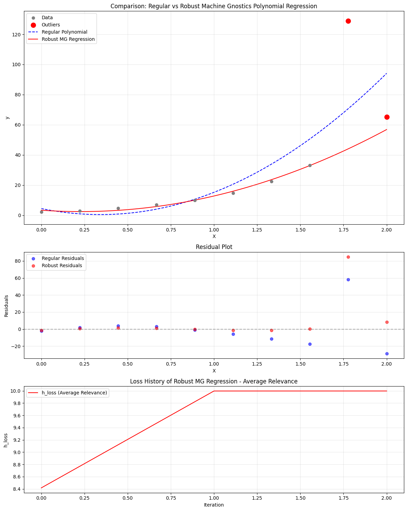

# RobustRegressor: Polynomial Robust Regression with Machine Gnostics

**RobustRegressor** is a polynomial regression model built on the Machine Gnostics framework. It is designed for robust, interpretable regression in the presence of outliers, noise, and non-Gaussian data distributions. Unlike traditional statistical models, RobustRegressor leverages algebraic and geometric principles from Mathematical Gnostics to deliver deterministic, resilient, and event-level modeling.

---

## Overview

The Machine Gnostics RobustRegressor fits a polynomial regression function to your data, using a gnostic-based weighting scheme to minimize the influence of outliers and corrupted samples. It iteratively optimizes regression coefficients by minimizing a custom gnostic loss (such as `'hi'` or `'hj'`), making it highly robust for real-world applications.

- **Robust to Outliers:** Handles heavy-tailed and non-Gaussian distributions.
- **Polynomial Feature Expansion:** Supports configurable polynomial degrees.
- **Gnostic Loss Minimization:** Iterative, event-level loss minimization.
- **Custom Weighting:** Dynamically adjusts sample influence.
- **Early Stopping & Convergence:** Monitors loss and entropy for efficient training.
- **mlflow Integration:** For experiment tracking and deployment.
- **Easy Model Persistence:** Save and load models with joblib.

---

## Key Features

- **Polynomial regression (configurable degree)**
- **Gnostic-based iterative loss minimization**
- **Custom weighting and scaling strategies**
- **Early stopping and convergence control**
- **Training history tracking for analysis and visualization**
- **Robust to outliers and non-Gaussian noise**

---

## Parameters

| Parameter          | Type            | Default | Description                                                                   |
| ------------------ | --------------- | ------- | ----------------------------------------------------------------------------- |
| `degree`         | int             | 1       | Degree of the polynomial for feature expansion (must be >= 1).                |
| `max_iter`       | int             | 100     | Maximum number of training iterations.                                        |
| `tol`            | float           | 1e-3    | Convergence threshold for loss or coefficient changes.                        |
| `mg_loss`        | str             | 'hi'    | Type of gnostic loss:`'hi'` (estimation relevance), `'hj'` (irrelevance). |
| `early_stopping` | bool or int     | True    | Enables early stopping or sets window size.                                   |
| `verbose`        | bool            | False   | Prints progress and debug information.                                        |
| `scale`          | {'auto', float} | 'auto'  | Scaling strategy for the gnostic loss.                                        |
| `history`        | bool            | True    | Records training history at each iteration.                                   |
| `data_form`      | str             | 'a'     | Input data form:`'a'` (additive), `'m'` (multiplicative).                 |

---

## Attributes

- **coefficients**: `ndarray`Final learned polynomial regression coefficients.
- **weights**: `ndarray`Final sample weights after convergence.
- **_history**: `list of dict`
  Training history, including iteration, loss, coefficients, rentropy, and weights.

---

## Methods

### `fit(X, y)`

Fits the model to training data using polynomial expansion and gnostic loss minimization.

- **X**: array-like, shape (n_samples,) or (n_samples, 1)Input features (numpy, pandas, or pyspark DataFrame).
- **y**: array-like, shape (n_samples,)
  Target values.

### `predict(X)`

Predicts output values for new input samples using the trained model.

- **X**: array-like, shape (n_samples,) or (n_samples, 1)Input features for prediction.
- **Returns**:
  `y_pred`: ndarray, shape (n_samples,)
  Predicted target values.

### `save_model(path)`

Saves the trained model to disk using joblib.

- **path**: str
  Directory path to save the model.

### `load_model(path)`

Loads a previously saved model from disk.

- **path**: strDirectory path where the model is saved.
- **Returns**:
  Instance of `RobustRegressor` with loaded parameters.

---

## Example Usage

```python
from machinegnostics.models import RobustRegressor

# Initialize the model
model = RobustRegressor(degree=2, mg_loss='hi', verbose=True)

# Fit the model
model.fit(X_train, y_train)

# Predict
y_pred = model.predict(X_test)

# Access coefficients and weights
print("Coefficients:", model.coefficients)
print("Weights:", model.weights)

# Save the model
model.save_model("./my_model")

# Load the model
loaded = RobustRegressor.load_model("./my_model")
y_pred2 = loaded.predict(X_test)
```

---

## Training History

The model records training history at each iteration, accessible via `model._history`.Each entry contains:

- `iteration`: Iteration number
- `h_loss`: Gnostic loss value
- `coefficients`: Regression coefficients at this iteration
- `rentropy`: Rentropy value
- `weights`: Sample weights at this iteration

This enables detailed analysis and visualization of the training process.


---

## Example

Machine Gnostic Polynomial Regression example notebooks: 

- [Example 1](https://github.com/MachineGnostics/machinegnostics.io/blob/main/examples/example_2_1_small_data_polyreg.ipynb)

- [Example 2](https://github.com/MachineGnostics/machinegnostics.io/blob/main/examples/example_2_wine_data_polyreg.ipynb)



---

!!! note "Note"

- The model is robust to outliers and suitable for datasets with non-Gaussian noise.
- Supports integration with mlflow for experiment tracking and deployment.
- For more information, visit: [https://machinegnostics.info/](https://machinegnostics.info/)
- Source code: [https://github.com/MachineGnostics/machinegnostics](https://github.com/MachineGnostics/machinegnostics)

---

## License

Machine Gnostics - Machine Gnostics Library  
Copyright (C) 2025  Machine Gnostics Team

This work is licensed under the terms of the GNU General Public License version 3.0.

**Author:** Nirmal Parmar
**Date:** 2025-10-01

---
