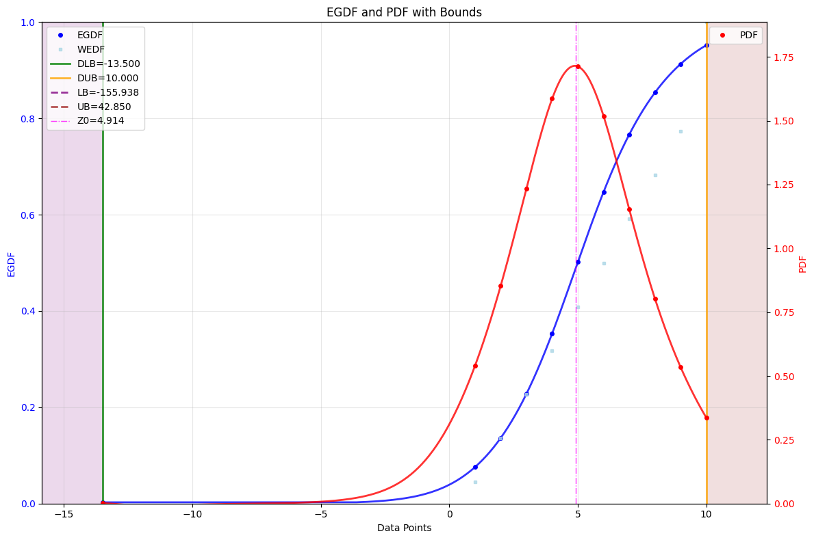
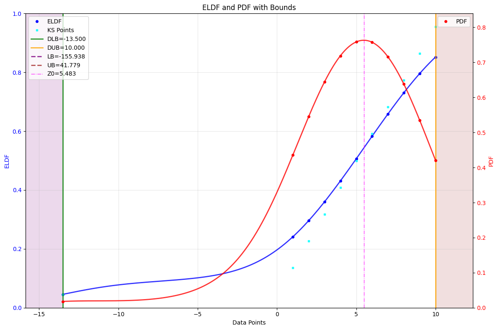
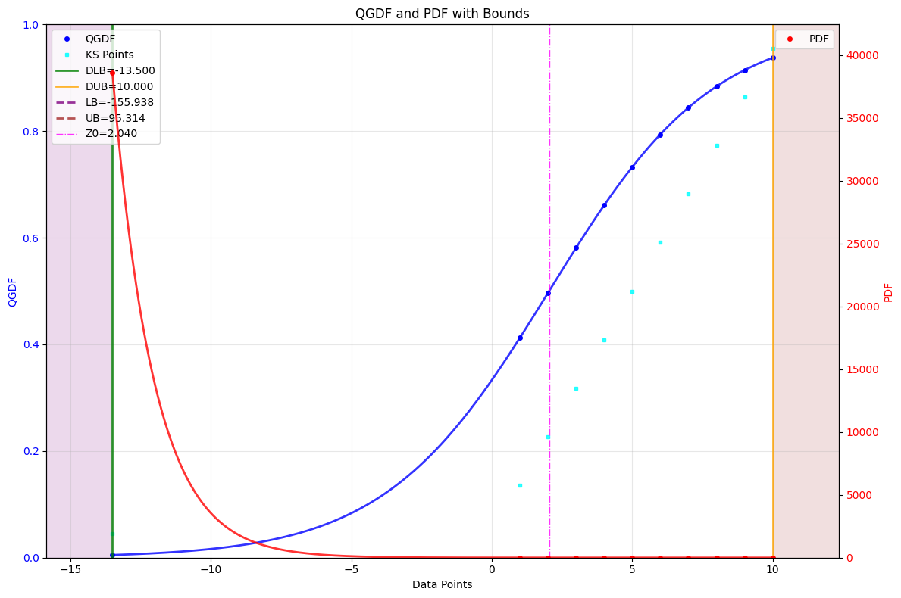
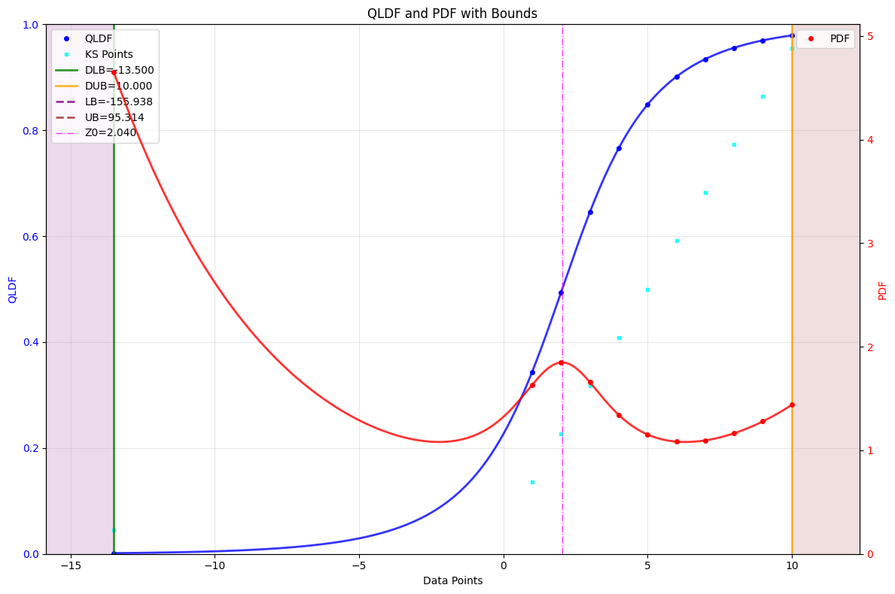

# Gnostic Distribution Functions

Gnostic Distribution Functions (GDF) are a new class of probability and density estimators designed for robust, flexible, and assumption-free data analysis. Unlike traditional statistical distributions, GDFs do not require any prior assumptions about the underlying data distribution. Instead, they allow the data to "speak for themselves," making them especially powerful for small, noisy, or uncertain datasets.

More information available [here](../mg/gdf.md).

---

## EGDF - Estimating Global Distribution Function

The EGDF provides a robust global estimate of the distribution function for your data.

!!! example "Estimating Global Distribution Function"
    ```python
    from machinegnostics.magcal import EGDF

    # create an EGDF object
    egdf = EGDF(verbose=False)

    # fit the data
    egdf.fit(data=data)

    # plot GDF
    egdf.plot(bounds=True)

    # check parameters
    print(egdf.params)
    ```



---

## ELDF - Estimating Local Distribution Function

The ELDF focuses on local properties of the data distribution, providing detailed insight into local data behavior.

!!! example "Estimating Local Distribution Function"
    ```python
    from machinegnostics.magcal import ELDF

    # create an ELDF object
    eldf = ELDF(verbose=False)

    # fit the data
    eldf.fit(data=data)

    # plot GDF
    eldf.plot(bounds=True)

    # check parameters
    print(eldf.params)
    ```



---

## QGDF - Quantifying Global Distribution Function

QGDF quantifies global distribution characteristics, useful for uncertainty quantification and diagnostics.

!!! example "Quantifying Global Distribution Function"
    ```python
    from machinegnostics.magcal import QGDF

    # create a QGDF object
    qgdf = QGDF(verbose=False)

    # fit the data
    qgdf.fit(data=data)

    # plot GDF
    qgdf.plot(bounds=True)

    # check parameters
    print(qgdf.params)
    ```



---

## QLDF - Quantifying Local Distribution Function

QLDF quantifies local distribution characteristics, providing fine-grained uncertainty and fidelity measures.

!!! example "Quantifying Local Distribution Function"
    ```python
    from machinegnostics.magcal import QLDF

    # create a QLDF object
    qldf = QLDF(verbose=False)

    # fit the data
    qldf.fit(data=data)

    # plot GDF
    qldf.plot(bounds=True)

    # check parameters
    print(qldf.params)
    ```



---

## Tips

- All GDF classes (`EGDF`, `ELDF`, `QGDF`, `QLDF`) follow a similar API: create an object, fit your data, plot results, and inspect parameters.
- Use the `bounds=True` option in `.plot()` to visualize uncertainty bounds.
- For more advanced usage and parameter tuning, see the [API Reference](../da/egdf.md).

---

**Next:**
Explore more tutorials and real-world examples in the [Examples](examples.md) section!
