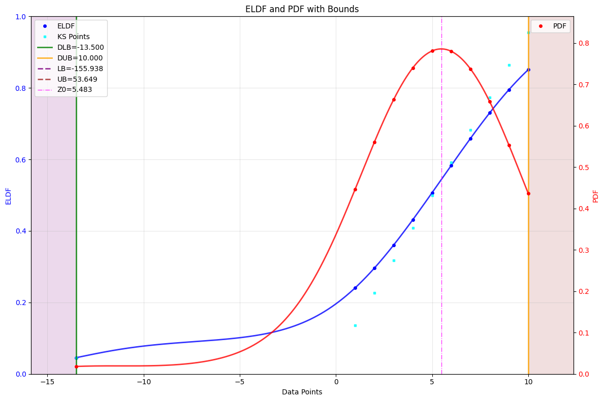
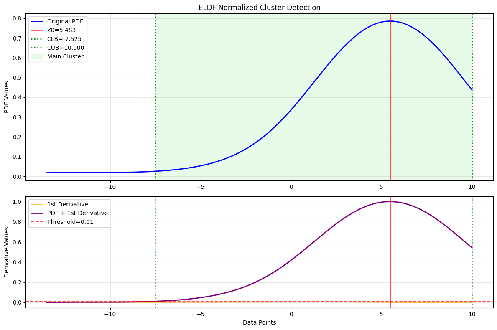
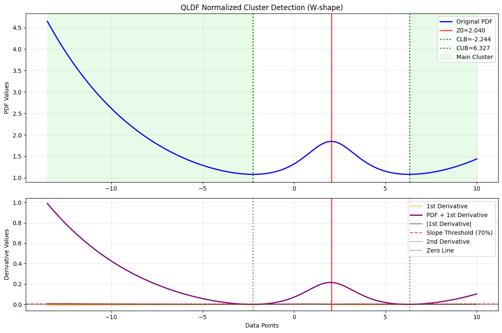

# Gnostics Cluster Analysis

The `ClusterAnalysis` class provides an end-to-end, automated workflow for estimating the main cluster bounds of a dataset using Gnostic Distribution Functions (GDFs) and advanced clustering analysis. This approach is robust, interpretable, and reproducible, making it ideal for scientific, engineering, and data science applications where reliable interval estimation is needed.

Key Features:

- Fully automated pipeline for cluster-based bound estimation
- Integrates GDF fitting, homogeneity testing, and cluster analysis
- Supports both local (ELDF) and global (EGDF) GDFs
- Handles weighted data, bounded/unbounded domains, and advanced parameterization
- Detailed error/warning logging and reproducible parameter tracking
- Optional memory-efficient operation via flushing intermediate results
- Visualization support for both GDF and cluster analysis results

---

## 1. Basic Usage: Automated Cluster Bound Estimation

Let’s see how to estimate the main cluster bounds for a dataset with an outlier.

!!! example "Basic Cluster Analysis"
    ```python
    import numpy as np
    from machinegnostics.magcal import ClusterAnalysis

    # Example data with an outlier
    data = np.array([-13.5, 1, 2, 3, 4, 5, 6, 7, 8, 9, 10])
    print("Data: ", data)

    # Create a ClusterAnalysis object
    ca = ClusterAnalysis(verbose=False, flush=False)

    # Fit the data and get cluster bounds
    clb, cub = ca.fit(data=data)

    # Plot the clusters and data
    ca.plot()

    # Check results
    ca.results()

    # Print the cluster bounds
    print("Cluster Lower Bound: ", clb)
    print("Cluster Upper Bound: ", cub)
    print("CLB and CUB present the bounds of the main cluster in the data.")
    ```

**Output:**





---

## 2. Advanced Usage: Manual GDF and Cluster Analysis

For advanced users, you can manually fit a GDF and perform cluster analysis for more control and customization.

!!! example "Advanced Cluster Analysis"
    ```python
    import numpy as np
    from machinegnostics.magcal import QLDF, ELDF, DataCluster

    data = np.array([-13.5, 1, 2, 3, 4, 5, 6, 7, 8, 9, 10])

    # Step 1: Fit a GDF (local DFs are a good choice for cluster analysis)
    qldf = QLDF()
    qldf.fit(data=data)

    eldf = ELDF()
    eldf.fit(data=data)

    # Step 2: Manual Cluster Analysis using DataCluster
    dc = DataCluster(gdf=eldf, verbose=False)
    clb, cub = dc.fit(plot=True)
    dc.results()

    # OR, if interested in inliers, use QLDF
    dc = DataCluster(gdf=qldf, verbose=False)
    clb, cub = dc.fit(plot=True)
    dc.results()
    ```

**Typical Output:**

```python
{
 'gdf_type': 'qldf',
 'derivative_threshold': 0.01,
 'slope_percentile': 70,
 'LCB': -2.24,
 'UCB': 6.33,
 'Z0': 2.04,
 'S_opt': 1.0,
 'cluster_width': 8.57,
 'clustering_successful': True,
 'method_used': 'qldf_w-shape_valley_detection',
 'normalization_method': 'min_max_normalization',
 'pdf_shape': 'W-shape',
 'errors': [],
 'warnings': []
}
```

**ELDF**


**QLDF**




[API Reference](../da/cluster_analysis.md)

---

## Tips

- Use `ClusterAnalysis` for a fully automated workflow, or `DataCluster` for manual, fine-grained control.
- Both local (ELDF/QLDF) and global (EGDF/QGDF) GDFs can be used depending on your analysis needs.
- For more advanced usage and parameter tuning, see the [API Reference](../da/cluster_analysis.md).

---

**Next:**  
Explore more tutorials and real-world examples in the [Examples](examples.md) section!