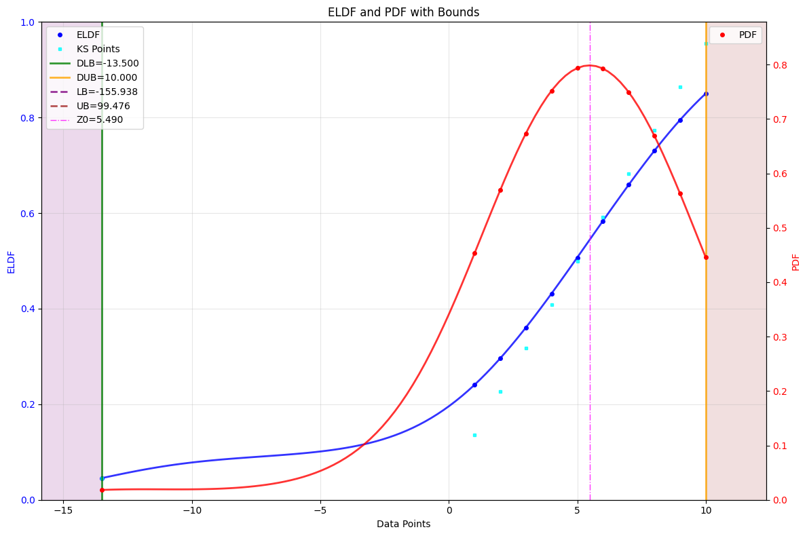
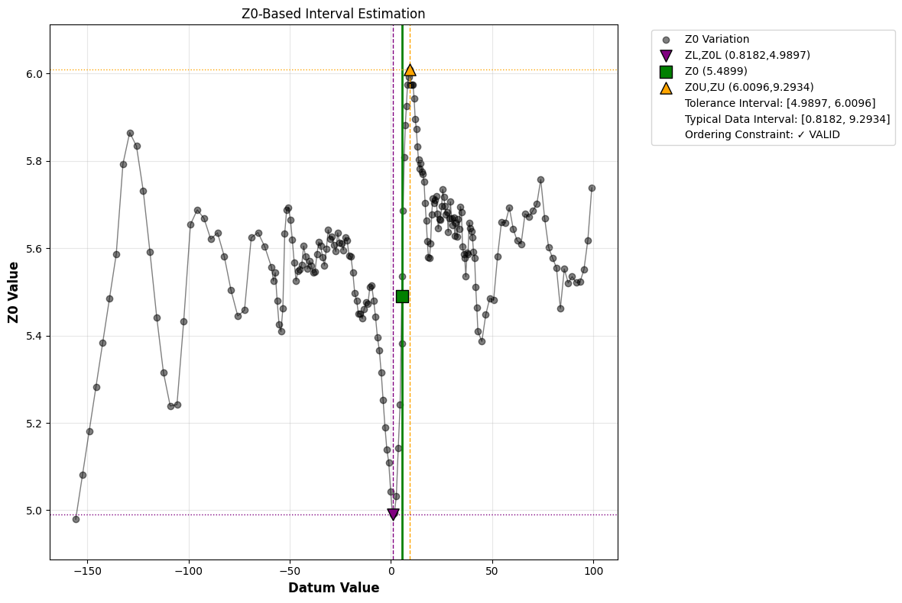
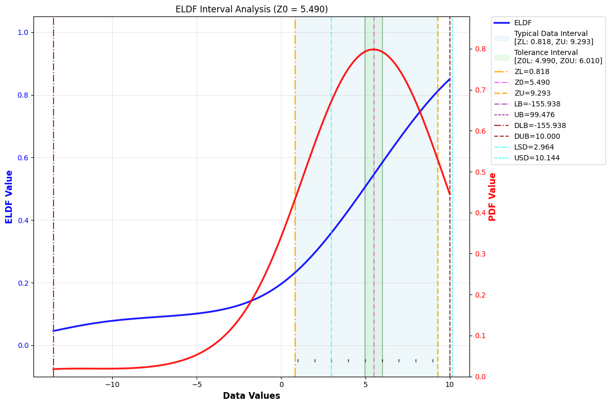
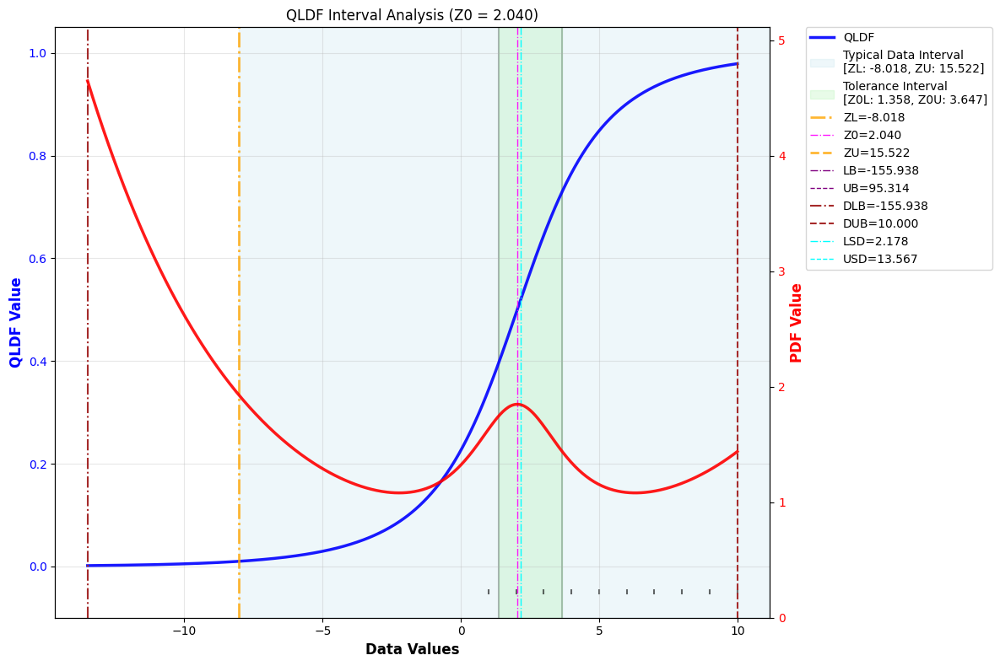

# Gnostics Interval Analysis

The `IntervalAnalysis` class provides a robust, automated workflow for estimating meaningful data intervals (such as tolerance and typical intervals) using Gnostic Distribution Functions (GDFs). It is designed for reliability, diagnostics, and adaptive interval estimation in scientific and engineering data analysis.

Key Features:

- End-to-end marginal interval analysis for GDFs
- Automated fitting of global (EGDF) and local (ELDF) distributions
- Homogeneity testing and adaptive re-fitting for non-homogeneous data
- Robust computation of practical, sample, and cluster-based bounds
- Detailed diagnostics, warnings, and error tracking
- Visualization of fitted distributions and estimated intervals

---

## 1. Basic Usage: Automated Interval Estimation

Let’s estimate robust data intervals for a dataset with an outlier using the automated pipeline.

!!! example "Basic Interval Analysis"
	```python
	import numpy as np
	from machinegnostics.magcal import IntervalAnalysis

    # Example data with an outlier
	data = np.array([-13.5, 1, 2, 3, 4, 5, 6, 7, 8, 9, 10])
	print("Data: ", data)

    # Create an IntervalAnalysis object
	ia = IntervalAnalysis(verbose=False, n_points=100)

    # Fit the data
	ia.fit(data)

    # Plot interval analysis insights
	ia.plot()

    # Results: gnostics data certification
	data_certification = ia.results()
	for key, value in data_certification.items():
		print(f"{key}: {value}")
	```


**ELDF**



**Interval Analysis**



**Interval Analysis and GDF**



**Typical Output:**

```python
LB: -155.93776968450086
LSB: -13.5
DLB: -13.5
LCB: -7.803030303030303
LSD: 2.964280971014115
ZL: 0.8182394174126442
Z0L: 4.9896988533352395
Z0: 5.48989898989899
Z0U: 6.0096390584764325
ZU: 9.293449080684455
USD: 10.143637329814027
UCB: 10.0
DUB: 10.0
USB: 10.595725263965676
UB: 99.47565393644747
```

---

## 2. Advanced Usage: Manual GDF and Interval Analysis

For advanced users, you can manually fit a GDF and perform interval analysis for more control and customization.

!!! example "Advanced Interval Analysis"
	```python
	import numpy as np
	from machinegnostics.magcal import QLDF, ELDF, DataIntervals

    data = np.array([-13.5, 1, 2, 3, 4, 5, 6, 7, 8, 9, 10])

    # Step 1: Fit a GDF (local DFs are a good choice for interval analysis)
	qldf = QLDF()
	qldf.fit(data=data)

    eldf = ELDF()
	eldf.fit(data=data)

    # Step 2: Manual Interval Analysis using DataIntervals
	data_intervals = DataIntervals(gdf=eldf)
	data_intervals.fit()
	data_intervals.plot()
	print(data_intervals.results())

    # OR, if interested in inliers, use QLDF
	data_intervals_inliers = DataIntervals(gdf=qldf, verbose=False)
	data_intervals_inliers.fit()
	data_intervals_inliers.plot()
	print(data_intervals_inliers.results())
	```

**Typical Output (ELDF):**


```python
{'LB': -155.93776968450086,
 'LSB': None,
 'DLB': -13.5,
 'LCB': None,
 'LSD': 2.882567969218145,
 'ZL': 0.8103374961119698,
 'Z0L': 4.938000938000959,
 'Z0': 5.483483483483482,
 'Z0U': 6.0232151117425685,
 'ZU': 9.668716398907417,
 'USD': 10.43118199977495,
 'UCB': None,
 'DUB': 10.0,
 'USB': None,
 'UB': 41.7788339826821}
```

**Typical Output (QLDF):**



```python
{'LB': -155.93776968450086,
 'LSB': None,
 'DLB': -13.5,
 'LCB': None,
 'LSD': 2.1784866717814797,
 'ZL': -8.017505807458605,
 'Z0L': 1.3583846325048605,
 'Z0': 2.04044550905268,
 'Z0U': 3.647143462258168,
 'ZU': 15.521880274960733,
 'USD': 13.566684391621703,
 'UCB': None,
 'DUB': 10.0,
 'USB': None,
 'UB': 95.31359676026301}
```

---

## Tips

- Use `IntervalAnalysis` for a fully automated workflow, or `DataIntervals` for manual, fine-grained control.
- Both local (ELDF/QLDF) and global (EGDF/QGDF) GDFs can be used depending on your analysis needs.
- For more advanced usage and parameter tuning, see the [API Reference](../da/interval_analysis.md).

---

**Next:**
Explore more tutorials and real-world examples in the [Examples](examples.md) section!
