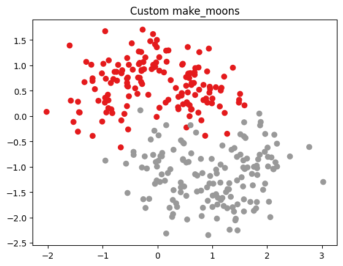
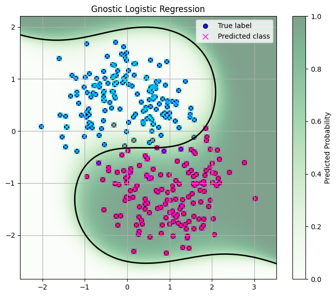
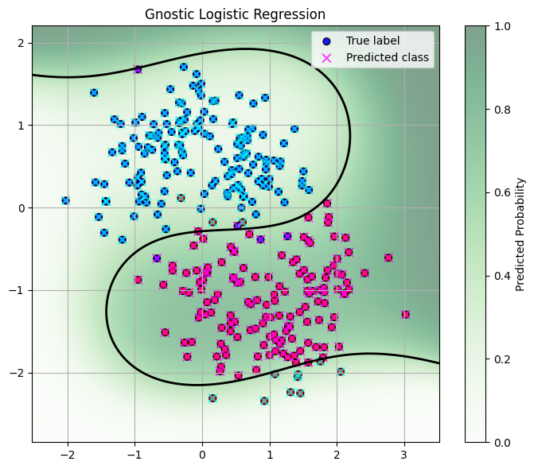

# Machine Gnostics Logistic Regression

The `LogisticRegressor` is a robust and flexible binary classification model built on the Machine Gnostics framework. It is designed to handle outliers, heavy-tailed distributions, and non-Gaussian noise, making it suitable for real-world data challenges. The model supports polynomial feature expansion, robust weighting, early stopping, and seamless MLflow integration for experiment tracking and deployment.

Key Features:

- Robust to outliers and non-Gaussian noise
- Polynomial feature expansion (configurable degree)
- Flexible probability output: gnostic or sigmoid
- Customizable data scaling (auto or manual)
- Early stopping based on residual entropy or log loss
- Full training history tracking (loss, entropy, coefficients, weights)
- MLflow integration for model tracking and deployment
- Save and load model using joblib

---

## 1. Overview

Machine Gnostics LogisticRegressor brings deterministic, event-level modeling to binary classification. By leveraging gnostic algebra and geometry, it provides robust, interpretable, and reproducible results, even in challenging scenarios.

Highlights:

- Outlier Robustness: Gnostic weighting reduces the impact of noisy or corrupted samples.
- Polynomial Feature Expansion: Configurable degree for nonlinear decision boundaries.
- Flexible Probability Output: Choose between gnostic-based or standard sigmoid probabilities.
- Early Stopping: Efficient training via monitoring of loss and entropy.
- MLflow Integration: Supports experiment tracking and deployment.
- Model Persistence: Save and load models easily with joblib.

---

## 2. Gnostic Logistic Regression

Let’s see how to use the Machine Gnostics LogisticRegressor for robust binary classification on a synthetic dataset.

!!! Example "Moon Data"
    ```python
    import numpy as np
    import matplotlib.pyplot as plt

    def make_moons_manual(n_samples=100, noise=0.1):
        n_samples_out = n_samples // 2
        n_samples_in = n_samples - n_samples_out

    # First half moon
        outer_circ_x = np.cos(np.linspace(0, np.pi, n_samples_out))
        outer_circ_y = np.sin(np.linspace(0, np.pi, n_samples_out))

    # Second half moon
        inner_circ_x = 1 - np.cos(np.linspace(0, np.pi, n_samples_in))
        inner_circ_y = -np.sin(np.linspace(0, np.pi, n_samples_in)) - 0.5

    X = np.vstack([
            np.stack([outer_circ_x, outer_circ_y], axis=1),
            np.stack([inner_circ_x, inner_circ_y], axis=1)
        ])
        y = np.array([0] * n_samples_out + [1] * n_samples_in)

    # Add noise
        X += np.random.normal(scale=noise, size=X.shape)

    return X, y

    # Example usage
    X, y = make_moons_manual(n_samples=300, noise=0.4)
    plt.scatter(X[:, 0], X[:, 1], c=y, cmap=plt.cm.Set1)
    plt.title("Custom make_moons")
    plt.show()
    ```



!!! example "Basic Logistic Regression (Sigmoid Probability)"
	```python
    import matplotlib.pyplot as plt
    import numpy as np
    from machinegnostics.models.classification import LogisticRegressor
    from machinegnostics.metrics import accuracy_score, confusion_matrix, classification_report, f1_score, precision_score, recall_score

    # using gnostic influenced sigmoid function for probability estimation
    model = LogisticRegressor(degree=3,verbose=True, early_stopping=True, proba='sigmoid', tol=0.1, max_iter=100)
    model.fit(X, y)
    proba_gnostic = model.predict_proba(X)
    y_pred_gnostic = model.predict(X)

    # --- Plot probability contour and predictions ---
    fig, ax = plt.subplots(figsize=(7, 6))

    def plot_proba_contour(ax, model, X, title):
        x_min, x_max = X[:, 0].min() - .5, X[:, 0].max() + .5
        y_min, y_max = X[:, 1].min() - .5, X[:, 1].max() + .5
        xx, yy = np.meshgrid(np.linspace(x_min, x_max, 300),
                            np.linspace(y_min, y_max, 300))
        grid = np.c_[xx.ravel(), yy.ravel()]
        zz = model.predict_proba(grid)
        zz = zz.reshape(xx.shape)

    im = ax.imshow(zz, extent=(x_min, x_max, y_min, y_max), origin='lower',
                    aspect='auto', cmap='Greens', alpha=0.5, vmin=0, vmax=1)
        plt.colorbar(im, ax=ax, label='Predicted Probability')
        ax.contour(xx, yy, zz, levels=[0.5], colors='k', linewidths=2)
        ax.set_xlim(x_min, x_max)
        ax.set_ylim(y_min, y_max)
        ax.set_title(title)

    plot_proba_contour(ax, model, X, "Gnostic Logistic Regression")
    ax.scatter(X[:, 0], X[:, 1], c=y, cmap='bwr', edgecolor='k', s=40, label='True label', alpha=0.9)
    ax.scatter(X[:, 0], X[:, 1], c=y_pred_gnostic, cmap='cool', marker='x', s=60, label='Predicted class', alpha=0.7)
    ax.legend()
    ax.grid(True)
    plt.tight_layout()
    plt.show()

    # --- Evaluation ---
    print('Gnostic Logistic Regression Evaluation:')
    print("Accuracy:", accuracy_score(y, y_pred_gnostic))
    print("Precision:", precision_score(y, y_pred_gnostic))
    print("Recall:", recall_score(y, y_pred_gnostic))
    print("F1-score:", f1_score(y, y_pred_gnostic))
    print("\nConfusion Matrix:\n", confusion_matrix(y, y_pred_gnostic))
    print("\nClassification Report:\n", classification_report(y, y_pred_gnostic))

    ```

**Output**



```python
Gnostic Logistic Regression Evaluation:
Accuracy: 0.9733333333333334
Precision: 0.9797297297297297
Recall: 0.9666666666666667
F1-score: 0.9731543624161074

Confusion Matrix:
 [[147   3]
 [  5 145]]

Classification Report:
 Class           Precision    Recall  F1-score   Support
========================================================
0                    0.97      0.98      0.97       150
1                    0.98      0.97      0.97       150
========================================================
Avg/Total            0.97      0.97      0.97       300
```

---

## 3. Gnostic Probability Output

The `proba` argument in `LogisticRegressor` can be set to `'gnostics'` to use a gnostic-based probability estimation, which is more robust to outliers and non-Gaussian data.

!!! example "Advanced: Gnostic Probability Output"
	```python
    # using gnostic probability estimation
    model = LogisticRegressor(degree=3,verbose=True, early_stopping=True, max_iter=100, proba='gnostic', tol=0.1)
    model.fit(X, y)
    proba_gnostic = model.predict_proba(X)
    y_pred_gnostic = model.predict(X)

    # --- Plot probability contour and predictions ---
    fig, ax = plt.subplots(figsize=(7, 6))

    def plot_proba_contour(ax, model, X, title):
        x_min, x_max = X[:, 0].min() - .5, X[:, 0].max() + .5
        y_min, y_max = X[:, 1].min() - .5, X[:, 1].max() + .5
        xx, yy = np.meshgrid(np.linspace(x_min, x_max, 300),
                            np.linspace(y_min, y_max, 300))
        grid = np.c_[xx.ravel(), yy.ravel()]
        zz = model.predict_proba(grid)
        zz = zz.reshape(xx.shape)

    im = ax.imshow(zz, extent=(x_min, x_max, y_min, y_max), origin='lower',
                    aspect='auto', cmap='Greens', alpha=0.5, vmin=0, vmax=1)
        plt.colorbar(im, ax=ax, label='Predicted Probability')
        ax.contour(xx, yy, zz, levels=[0.5], colors='k', linewidths=2)
        ax.set_xlim(x_min, x_max)
        ax.set_ylim(y_min, y_max)
        ax.set_title(title)

    plot_proba_contour(ax, model, X, "Gnostic Logistic Regression")
    ax.scatter(X[:, 0], X[:, 1], c=y, cmap='bwr', edgecolor='k', s=40, label='True label', alpha=0.9)
    ax.scatter(X[:, 0], X[:, 1], c=y_pred_gnostic, cmap='cool', marker='x', s=60, label='Predicted class', alpha=0.7)
    ax.legend()
    ax.grid(True)
    plt.tight_layout()
    plt.show()

    # --- Evaluation ---
    print('Gnostic Logistic Regression Evaluation:')
    print("Accuracy:", accuracy_score(y, y_pred_gnostic))
    print("Precision:", precision_score(y, y_pred_gnostic))
    print("Recall:", recall_score(y, y_pred_gnostic))
    print("F1-score:", f1_score(y, y_pred_gnostic))
    print("\nConfusion Matrix:\n", confusion_matrix(y, y_pred_gnostic))
    print("\nClassification Report:\n", classification_report(y, y_pred_gnostic))
	```

**Output**



```python
Gnostic Logistic Regression Evaluation:
Accuracy: 0.9433333333333334
Precision: 0.965034965034965
Recall: 0.92
F1-score: 0.9419795221843004

Confusion Matrix:
 [[145   5]
 [ 12 138]]

Classification Report:
 Class           Precision    Recall  F1-score   Support
========================================================
0                    0.92      0.97      0.94       150
1                    0.97      0.92      0.94       150
========================================================
Avg/Total            0.94      0.94      0.94       300
```

**Note:**

- The `proba` argument controls the probability estimation method: `'sigmoid'` (default) for standard logistic regression, `'gnostics'` for robust, gnostic-based probabilities.
- Use gnostic probabilities for datasets with outliers or non-Gaussian noise for more reliable classification.

---

## Tips

- Use `LogisticRegressor` for robust, interpretable binary classification, especially when data may contain outliers or non-Gaussian noise.
- Set `proba='gnostics'` for robust probability estimation.
- Adjust the `degree` parameter for nonlinear decision boundaries.
- Enable `early_stopping` for efficient training.
- For more advanced usage and parameter tuning, see the [API Reference](../models/cls/log_reg.md).

---

**Next:**
Explore more tutorials and real-world examples in the [Examples](examples.md) section!
