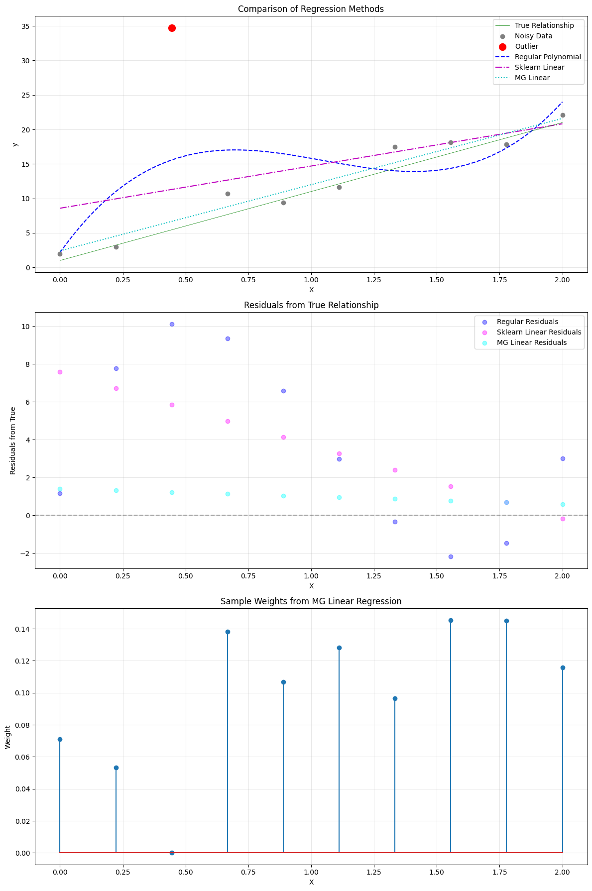

# Machine Gnostics Linear Regression

The `LinearRegressor` is a robust linear regression model built on the Machine Gnostics framework. Unlike traditional statistical models that rely on probabilistic assumptions, this model uses algebraic and geometric structures to provide deterministic, resilient, and interpretable regression for real-world data.

Key Features:

- Deterministic & Finite: No randomness or probability; all computations are reproducible.
- Event-Level Modeling: Handles uncertainty and error at the level of individual data events.
- Algebraic Inference: Utilizes gnostic algebra and error geometry for robust learning.
- Resilient: Designed to be robust against outliers, corrupted data, and distributional shifts.
- Flexible: Supports numpy arrays, pandas DataFrames, and pyspark DataFrames.
- mlflow Integration: For experiment tracking and deployment.
- Easy Model Persistence: Save and load models with joblib.

---

## 1. Basic Usage: Robust Linear Regression

Let’s compare the Machine Gnostics LinearRegressor with standard regression models on a dataset with noise and an outlier.

!!! example "Linear Regression"
	```python
    import numpy as np
    import matplotlib.pyplot as plt
    from sklearn.preprocessing import PolynomialFeatures
    from sklearn.linear_model import LinearRegression
    from sklearn.pipeline import make_pipeline

    # machine gnostics imports
    from machinegnostics.models.regression import LinearRegressor

    # Set random seed for reproducibility
    np.random.seed(42)

    # Generate clean data
    X = np.linspace(0, 2, 10).reshape(-1, 1)
    y_clean = 10 * X.ravel() + 1  # True linear relationship

    # Add controlled noise and outliers
    noise = np.random.normal(0, 2, 10)
    y_noisy = y_clean + noise
    y_noisy[2] = y_noisy[2] + 28.0  # Add outlier

    # Create test points for smooth curve
    X_test = np.linspace(0, 2, 100).reshape(-1, 1)

    degree = 3  # Using degree 1 for linear relationship

    # Regular polynomial regression
    poly_reg = make_pipeline(PolynomialFeatures(degree), LinearRegression())
    poly_reg.fit(X, y_noisy)
    y_pred_regular = poly_reg.predict(X)
    y_pred_regular_test = poly_reg.predict(X_test)

    # Fit sklearn LinearRegression (no polynomial features, just linear)
    sk_model = LinearRegression()
    sk_model.fit(X, y_noisy)
    y_pred_sk = sk_model.predict(X)
    y_pred_sk_test = sk_model.predict(X_test)

    # Fit Machine Gnostics LinearRegressor
    mg_linreg = LinearRegressor()
    mg_linreg.fit(X, y_noisy)
    y_pred_mg_linreg = mg_linreg.predict(X)
    y_pred_mg_linreg_test = mg_linreg.predict(X_test)

    # Create figure with subplots
    fig, (ax1, ax2, ax3) = plt.subplots(3, 1, figsize=(12, 18))

    # Plot regression curves
    ax1.plot(X, y_clean, 'g-', label='True Relationship', linewidth=0.5)
    ax1.scatter(X, y_noisy, color='gray', label='Noisy Data', zorder=2)
    ax1.scatter(X[2], y_noisy[2], color='red', s=100, label='Outlier', zorder=3)
    ax1.plot(X_test, y_pred_regular_test, 'b--', label='Regular Polynomial', zorder=1)
    ax1.plot(X_test, y_pred_sk_test, 'm-.', label='Sklearn Linear', zorder=1)
    ax1.plot(X_test, y_pred_mg_linreg_test, 'c:', label='MG Linear', zorder=1)
    ax1.set_xlabel('X')
    ax1.set_ylabel('y')
    ax1.set_title('Comparison of Regression Methods')
    ax1.legend()
    ax1.grid(True, alpha=0.3)

    # Plot residuals from true relationship
    residuals_regular = y_pred_regular - y_clean
    residuals_sk = y_pred_sk - y_clean
    residuals_mg_linreg = y_pred_mg_linreg - y_clean
    ax2.scatter(X, residuals_regular, color='blue', label='Regular Residuals', alpha=0.4)
    ax2.scatter(X, residuals_sk, color='magenta', label='Sklearn Linear Residuals', alpha=0.4)
    ax2.scatter(X, residuals_mg_linreg, color='cyan', label='MG Linear Residuals', alpha=0.4)
    ax2.axhline(y=0, color='k', linestyle='--', alpha=0.3)
    ax2.set_xlabel('X')
    ax2.set_ylabel('Residuals from True')
    ax2.set_title('Residuals from True Relationship')
    ax2.legend()
    ax2.grid(True, alpha=0.3)

    # Plot sample weights
    ax3.stem(X.ravel(), mg_linreg.weights, label='MG Linear Weights')
    ax3.set_xlabel('X')
    ax3.set_ylabel('Weight')
    ax3.set_title('Sample Weights from MG Linear Regression')
    ax3.grid(True, alpha=0.3)

    plt.tight_layout()
    plt.show()

    # Print performance metrics
    print("Coefficients:")
    print(f"True:           [Intercept: 1, Slope: 10]")
    print(f"Regular:        {poly_reg.named_steps['linearregression'].coef_}")
    print(f"Sklearn Linear: {sk_model.coef_}")
    print(f"MG Linear:      {mg_linreg.coefficients}")

    # Calculate MSE against true relationship
    mse_regular = np.mean((y_pred_regular[:-2] - y_clean[:-2])**2)
    mse_sk = np.mean((y_pred_sk[:-2] - y_clean[:-2])**2)
    mse_mg_linreg = np.mean((y_pred_mg_linreg[:-2] - y_clean[:-2])**2)
    print("\nMSE against true relationship (excluding outliers):")
    print(f"Regular Polynomial: {mse_regular:.4f}")
    print(f"Sklearn Linear:     {mse_sk:.4f}")
    print(f"MG Linear:          {mse_mg_linreg:.4f}")
	```

**Output:**



```python
Coefficients:
True:           [Intercept: 1, Slope: 10]
Regular:        [  0.          51.13182115 -54.84299636  17.369313  ]
Sklearn Linear: [6.11971484]
MG Linear:      [2.40285216 9.59521403]

MSE against true relationship (excluding outliers):
Regular Polynomial: 38.5847
Sklearn Linear:     24.6826
MG Linear:          1.2263
```

---

## Tips

- Use `LinearRegressor` for robust, interpretable linear regression, especially when data may contain outliers or non-Gaussian noise.
- All Machine Gnostics models are deterministic and reproducible—no randomness in fitting.
- For more advanced usage and parameter tuning, see the [API Reference](../models/ml_models.md).

---

**Next:**
Explore more tutorials and real-world examples in the [Examples](examples.md) section!
