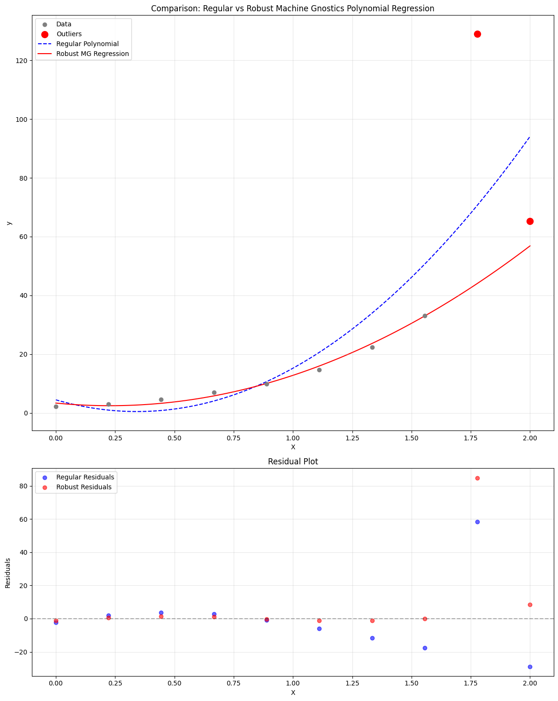

# Machine Gnostics Polynomial Regression

The `PolynomialRegressor` is a robust polynomial regression model built on the principles of Mathematical Gnostics. It is designed to provide deterministic, interpretable, and resilient regression in the presence of outliers, noise, and non-Gaussian data distributions. Unlike traditional statistical models, this regressor leverages algebraic and geometric concepts from Mathematical Gnostics, focusing on event-level modeling and robust loss minimization.

Key Features:

- Robust to Outliers: Uses gnostic loss functions and adaptive weights to minimize the influence of outliers and corrupted samples.
- Polynomial Feature Expansion: Supports configurable polynomial degrees for flexible modeling.
- Iterative Optimization: Employs iterative fitting with early stopping and convergence checks.
- Custom Gnostic Loss: Minimizes a user-selected gnostic loss ('hi', 'hj', etc.) for event-level robustness.
- Detailed Training History: Optionally records loss, weights, entropy, and gnostic characteristics at each iteration.
- Easy Integration: Compatible with numpy arrays and supports model persistence.

---

## 1. Basic Usage: Robust Polynomial Regression

Let’s compare the Machine Gnostics PolynomialRegressor with standard polynomial regression on a dataset with outliers.

!!! example "Basic Polynomial Regression"
	```python
	import numpy as np
	import matplotlib.pyplot as plt
	from sklearn.preprocessing import PolynomialFeatures
	from sklearn.linear_model import LinearRegression
	from sklearn.pipeline import make_pipeline
	from machinegnostics.models.regression import PolynomialRegressor

    # Set random seed for reproducibility
	np.random.seed(42)

    # Generate data
	X = np.linspace(0, 2, 10).reshape(-1, 1)
	y = 2.0 * np.exp(1.8 * X.ravel()) + np.random.normal(0, 0.2, 10)
	y[8:] += [80.0, -8.0]  # Add outliers

    # Create test points for smooth curve
	X_test = np.linspace(0, 2, 100).reshape(-1, 1)

    # Fit regular polynomial regression
	degree = 2
	poly_reg = make_pipeline(PolynomialFeatures(degree), LinearRegression())
	poly_reg.fit(X, y)
	y_pred_regular = poly_reg.predict(X)
	y_pred_regular_test = poly_reg.predict(X_test)

    # Fit robust Machine Gnostics regression
	mg_model = PolynomialRegressor(degree=degree)
	mg_model.fit(X, y.flatten())
	y_pred_robust = mg_model.predict(X)
	y_pred_robust_test = mg_model.predict(X_test)
	print(f'model coeff: {mg_model.coefficients}')

    # Calculate residuals
	residuals_regular = y - y_pred_regular
	residuals_robust = y - y_pred_robust

    # Create figure with subplots
	fig, (ax1, ax2) = plt.subplots(2, 1, figsize=(12, 15), height_ratios=[2, 1])

    # Plot regression curves
	ax1.scatter(X, y, color='gray', label='Data', zorder=2)
	ax1.scatter(X[8:], y[8:], color='red', s=100, label='Outliers', zorder=3)
	ax1.plot(X_test, y_pred_regular_test, 'b--', label='Regular Polynomial', zorder=1)
	ax1.plot(X_test, y_pred_robust_test, 'r-', label='Robust MG Regression', zorder=1)
	ax1.set_xlabel('X')
	ax1.set_ylabel('y')
	ax1.set_title('Comparison: Regular vs Robust Machine Gnostics Polynomial Regression')
	ax1.legend()
	ax1.grid(True, alpha=0.3)

    # Plot residuals
	ax2.scatter(X, residuals_regular, color='blue', label='Regular Residuals', alpha=0.6)
	ax2.scatter(X, residuals_robust, color='red', label='Robust Residuals', alpha=0.6)
	ax2.axhline(y=0, color='k', linestyle='--', alpha=0.3)
	ax2.set_xlabel('X')
	ax2.set_ylabel('Residuals')
	ax2.set_title('Residual Plot')
	ax2.legend()
	ax2.grid(True, alpha=0.3)

    plt.tight_layout()
	plt.show()

    # Print mean squared error for both methods (excluding outliers)
	mse_regular = np.mean((y_pred_regular[:-2] - y[:-2])**2)
	mse_robust = np.mean((y_pred_robust[:-2] - y[:-2])**2)
	print(f"MSE (excluding outliers):")
	print(f"Regular Polynomial: {mse_regular:.4f}")
	print(f"Robust MG Regression: {mse_robust:.4f}")

    # Print max absolute residuals (excluding outliers)
	max_resid_regular = np.max(np.abs(residuals_regular[:-2]))
	max_resid_robust = np.max(np.abs(residuals_robust[:-2]))
	print(f"\nMax Absolute Residuals (excluding outliers):")
	print(f"Regular Polynomial: {max_resid_regular:.4f}")
	print(f"Robust MG Regression: {max_resid_robust:.4f}")
	```

**Output:**



```python
MSE (excluding outliers):
Regular Polynomial: 63.8383
Robust MG Regression: 1.0044

Max Absolute Residuals (excluding outliers):
Regular Polynomial: 17.5910
Robust MG Regression: 1.3305
```

---

## 2. Custom Gnostic Loss and Training History

For advanced users, the `PolynomialRegressor` supports custom [gnostic loss](../metrics/g_relevance.md) functions, adaptive weighting, and detailed training history for analysis and visualization.

!!! example "Advanced: Custom Loss and Training History"

    ```python     
    # gnostic loss hi or hj     
    mg_model = PolynomialRegressor(degree=2, mg_loss='hi', history=True)     
    mg_model.fit(X, y)     
    # Access training history     
    history = mg_model._history     
    print(history)
    ```

---


## 3. Cross-Validation and Gnostic Mean Squared Error

Cross-validation is essential for evaluating model generalization. Machine Gnostics provides a `CrossValidator` for robust, assumption-free validation, and a gnostic version of mean squared error (MSE) that uses the gnostic mean instead of the statistical mean.

The gnostic mean is a robust, assumption-free measure designed to provide deeper insight and reliability, especially in the presence of outliers or non-normal data. This ensures that error metrics reflect the true structure and diagnostic properties of your data, in line with the principles of Mathematical Gnostics.

!!! example "Cross-Validation with Gnostic and Regular Metrics"
	```python
    # cross validation example (optional)

    from machinegnostics.models import CrossValidator
    from machinegnostics.metrics import mean_squared_error, root_mean_squared_error, mean_absolute_error

    # normal mean squared error
    def normal_mse(y_true, y_pred):
        return np.mean((y_true - y_pred) ** 2)

    # Define cross-validator
    cv = CrossValidator(model=mg_model, X=X, y=y, k=5, random_seed=42)

    # Perform cross-validation with mean absolute error
    cv_results = cv.evaluate(mean_absolute_error)
    print("\nCross-Validation Results (Gnostics - Mean Absolute Error):")
    for fold, mse in enumerate(cv_results, 1):
        print(f"Fold {fold}: {mse:.4f}")

    # cross validation with root mean absolute error
    cv_rmse = CrossValidator(model=mg_model, X=X, y=y, k=5, random_seed=42)
    cv_results_rmse = cv_rmse.evaluate(root_mean_squared_error)
    print("\nCross-Validation Results (Root Mean Squared Error):")
    for fold, rmse in enumerate(cv_results_rmse, 1):
        print(f"Fold {fold}: {rmse:.4f}")

    # cross validation with mean squared error
    cv_mae = CrossValidator(model=mg_model, X=X, y=y, k=5, random_seed=42)
    cv_results_mae = cv_mae.evaluate(mean_squared_error)
    print("\nCross-Validation Results (Mean Squared Error):")
    for fold, mae in enumerate(cv_results_mae, 1):
        print(f"Fold {fold}: {mae:.4f}")

    # cross validation with normal mse
    cv_normal = CrossValidator(model=mg_model, X=X, y=y, k=5, random_seed=42)
    cv_results_normal = cv_normal.evaluate(normal_mse)
    print("\nCross-Validation Results (Regular MSE):")
    for fold, mse in enumerate(cv_results_normal, 1):
        print(f"Fold {fold}: {mse:.4f}")
	```

**Note:**

- The `mean_squared_error` function from Machine Gnostics computes MSE using the gnostic mean, which is more robust to outliers and non-Gaussian data than the traditional mean. Explore more gnostic metrics [here](../metrics/g_mean.md)
- Use gnostic metrics for deeper, more reliable diagnostics in challenging data scenarios.

---

## Tips

- Use `PolynomialRegressor` for robust polynomial regression, especially when data may contain outliers or non-Gaussian noise.
- Adjust the `degree` parameter for higher-order polynomial fits.
- Use the `loss` parameter to select different gnostic loss functions for event-level robustness.
- Enable `record_history=True` to analyze training dynamics and convergence.
- For more advanced usage and parameter tuning, see the [API Reference](../models/ml_models.md).

---

**Next:**
Explore more tutorials and real-world examples in the [Examples](examples.md) section!
